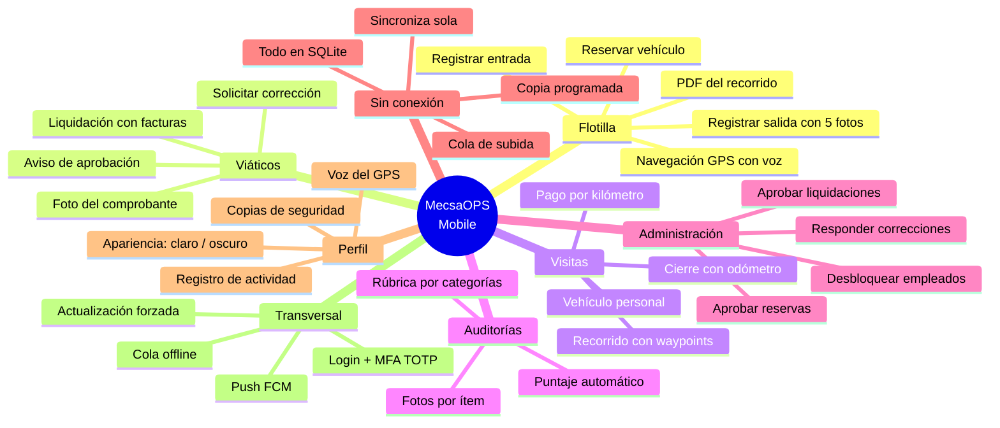
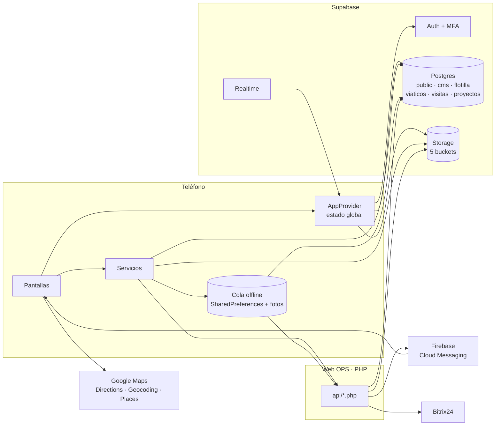
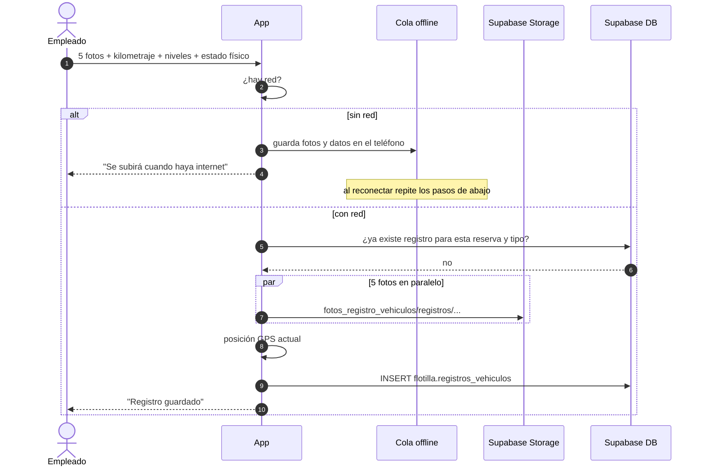
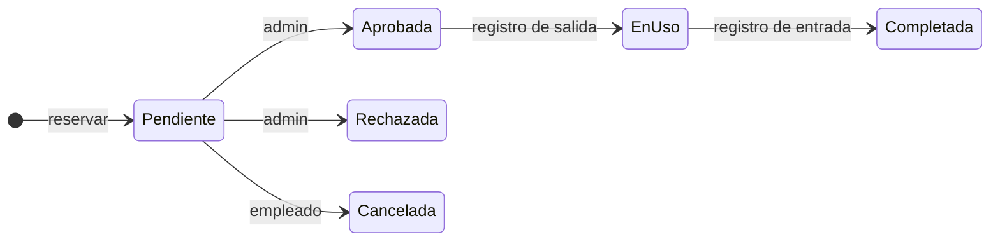
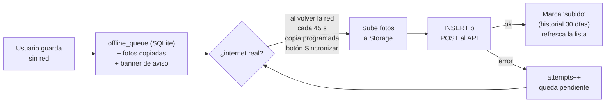
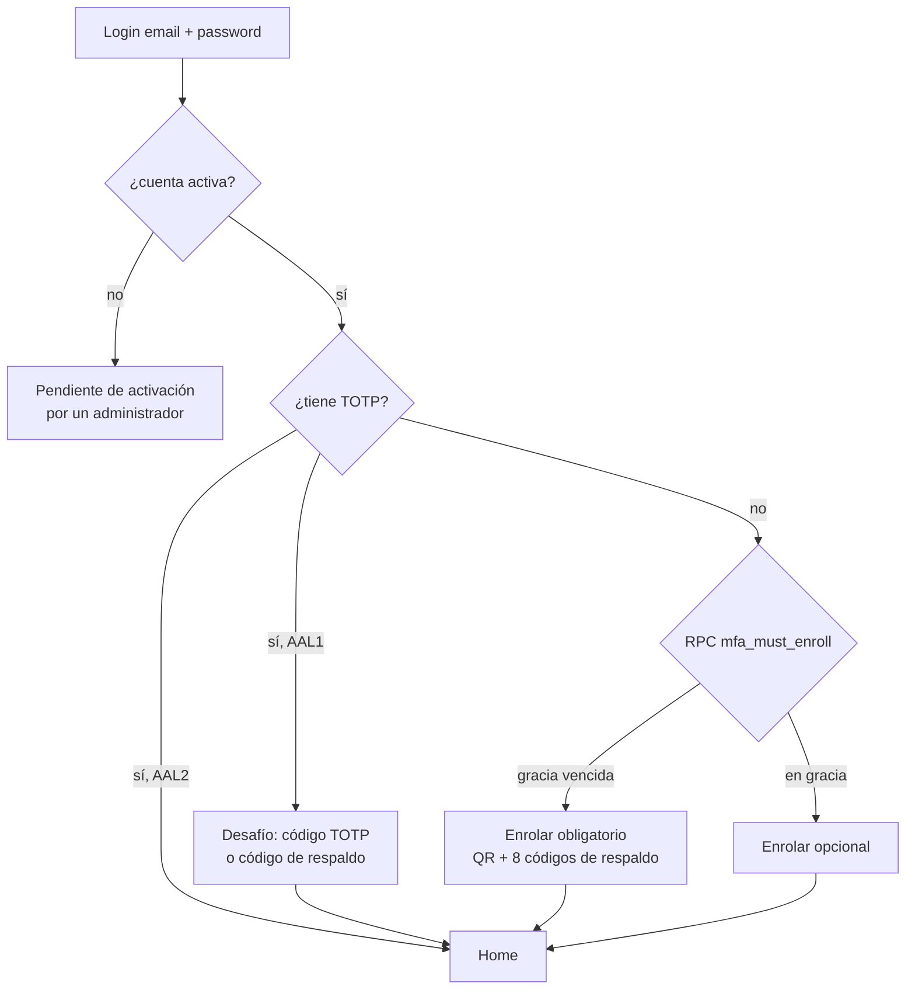
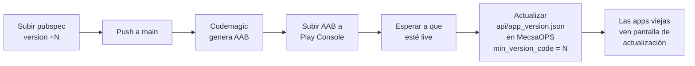

<div align="center">


# MecsaOPS Mobile

**La app de operaciones de campo de Grupo Mecsa.**
Flotilla · Viáticos · Visitas · Auditorías · Administración


<br/>

| 📴 **Funciona sin conexión** | 🔄 **Sincroniza sola** | 🗂️ **Copia de seguridad** | 📄 **Exporta PDF** | 🌙 **Modo oscuro** |
|:---:|:---:|:---:|:---:|:---:|
| Registros, liquidaciones y visitas se guardan en el teléfono y se suben al volver la red. Las fotos ya sincronizadas se ven sin red | Al recuperar internet, cada 45 s con pendientes y en la copia programada | Diaria, semanal o mensual, solo WiFi o con datos | Rutas, liquidaciones con comprobantes y visitas con fotos, listos para compartir | Claro, oscuro o según el sistema, desde Perfil → Apariencia |

</div>

---

App móvil de operaciones de **Grupo Mecsa** para el personal de campo. Reservas y uso de vehículos de la flotilla, liquidación de viáticos, visitas con pago de kilometraje, auditorías de vehículos y un modo de administración para aprobar desde el teléfono. Todo el trabajo de campo funciona **sin conexión**: se guarda en SQLite y se sincroniza solo.

| | |
|---|---|
| **Versión** | 1.5.8+36 |
| **Plataformas** | Android (Play Store, `com.grupomecsa.mecsa_ops_mobile`) e iOS |
| **Framework** | Flutter 3.47 · Dart SDK ^3.10 |
| **Backend** | Supabase (Postgres, Auth, Storage, Realtime) + API PHP de la web OPS |
| **Datos locales** | SQLite (`sqflite`): caché, cola offline, reservas, liquidaciones, vehículos, log |
| **Tareas de fondo** | WorkManager (copia de seguridad programada) |
| **CI** | Codemagic: AAB automático en cada push a `main` |
| **Documentación técnica** | [docs/](docs/README.md) con diagramas de secuencia por módulo |

---

## Índice

- [Qué hace la app](#qué-hace-la-app)
- [Arquitectura](#arquitectura)
- [Cómo fluye una operación típica](#cómo-fluye-una-operación-típica)
- [Módulos](#módulos)
- [Modo offline](#modo-offline)
- [Copia de seguridad](#copia-de-seguridad)
- [Exportar y compartir](#exportar-y-compartir)
- [Seguridad y acceso](#seguridad-y-acceso)
- [Estructura del código](#estructura-del-código)
- [Configuración y ejecución local](#configuración-y-ejecución-local)
- [Build y despliegue](#build-y-despliegue)
- [Documentación detallada](#documentación-detallada)

---

## Qué hace la app



---

## Arquitectura

La app no tiene servidor propio. Habla **directo con Supabase** para la mayoría de lecturas y escrituras, y pasa por los **endpoints PHP** del repositorio `MecsaOPS` (publicados en `https://grupomecsa.net/ops/api/`) cuando hace falta lógica de servidor o enviar notificaciones.



### Qué va directo y qué pasa por PHP

| Directo a Supabase | Vía API PHP |
|--------------------|-------------|
| Reservas: crear, cancelar, aprobar | Registro de empleado nuevo |
| Registros de salida/entrada y sus fotos | Crear liquidación (valida y avisa a Bitrix24) |
| Facturas: crear, editar, borrar | Aprobar liquidación (envía push) |
| Visitas: iniciar, waypoints | Finalizar visita (calcula km, tarifa y monto) |
| Auditorías y puntaje (RPC) | Códigos de respaldo MFA |
| Correcciones, perfil, tracking GPS | Versión mínima requerida |

---

## Cómo fluye una operación típica

Ejemplo: un empleado registra la salida de un vehículo reservado.



Cada módulo tiene su propio conjunto de diagramas en [docs/](docs/README.md).

---

## Módulos

### Flotilla

Reservar un vehículo de la empresa, registrar su salida y entrada con fotos, navegar con GPS y voz, y exportar un PDF del recorrido.



- Validación de traslape de horarios y disponibilidad del vehículo. **Crear una reserva requiere conexión**; el formulario lo avisa y desactiva el botón.
- **Salida y entrada funcionan sin conexión**: el registro (con sus 5 fotos) se guarda en el teléfono con un banner de aviso y se sube solo. El detalle de la reserva lo muestra como "pendiente de subir" hasta que el servidor confirma.
- Las reservas del empleado se guardan en SQLite y se sobrescriben con lo que devuelve el API.
- **Bloqueo por strikes**: con 3 o más reservas vencidas sin registrar salida, la función SQL `aplicar_bloqueo_si_corresponde` bloquea al empleado. Un admin puede desbloquear y marcar una excepción.
- El tracking GPS inserta puntos en `visitas.ops_tracking` cada 10 metros.
- Detalle en [docs/03-flotilla.md](docs/03-flotilla.md).

### Viáticos

Liquidación de gastos con facturas fotografiadas. Se crea vía `create_liquidacion.php`, que valida al empleado, al proyecto y exige descripción de 15 caracteres cuando no hay proyecto.

- Solo editable mientras está `pendiente`.
- **Sin conexión** se puede crear una liquidación completa (facturas y fotos): queda pendiente en la lista y se sube sola. El personal incluido y los últimos 100 proyectos están en caché para el formulario.
- Las liquidaciones del último mes, con facturas, viven en SQLite: la lista y el detalle abren sin red.
- Los **comprobantes se ven dentro de la app** (zoom) y quedan en caché. **Exportar PDF** arma datos, facturas, totales y una página por comprobante, y abre el menú de compartir.
- Después de aprobada o rechazada el empleado puede **solicitar corrección**.
- El resultado llega por dos vías: notificación local vía **Realtime** y push **FCM** desde el servidor.
- Detalle en [docs/04-viaticos.md](docs/04-viaticos.md).

### Visitas

Recorridos con el **vehículo personal** del empleado. Un wizard de tres pasos captura odómetro inicial con foto, traza el recorrido con waypoints y cierra con odómetro final y observaciones.

- **Sin conexión** se puede iniciar, recorrer y cerrar una visita: se encola con un id local y el servidor calcula kilómetros y monto al subir. Los vehículos personales del empleado están en SQLite para el selector.
- El detalle exporta un **PDF con fotos** para compartir y guarda las fotos en la galería.
- `finish_visita.php` calcula kilómetros, aplica un tarifario por tipo de vehículo, combustible y antigüedad, y guarda el monto a pagar.
- Cuando un admin confirma el pago en la web, la app recibe un push con `tipo: pago_kilometraje` y abre el detalle con el comprobante.
- Detalle en [docs/05-visitas.md](docs/05-visitas.md).

### Auditorías

Inspección de un vehículo de la flotilla contra una rúbrica de ítems por categoría. Cada ítem se marca `buen`, `mal` o `na`, con observación y fotos. La función SQL `recompute_auditoria` calcula el puntaje excluyendo los N/A.

- Visible solo con permiso `auditorias`.
- Detalle en [docs/06-auditorias.md](docs/06-auditorias.md).

### Administración

Modo admin dentro de la app (desde v1.5.0). Aparece en el Dashboard cuando el empleado tiene al menos uno de estos permisos:

| Tarjeta | Quién |
|---------|-------|
| Aprobar liquidaciones | Rol admin, contabilidad, responsable de departamento o permiso explícito |
| Aprobar reservas | Permiso `aprobar_reservas` |
| Correcciones | Permiso `procesar_correcciones` |
| Desbloquear reservas | Permiso `desbloquear_reservas` |

La app envía `actor_id` y el servidor re-lee el rol desde la base de datos. Detalle en [docs/07-administracion.md](docs/07-administracion.md).

---

## Modo offline

Todo lo que el personal de campo necesita se guarda en **SQLite** (`mecsa_ops_local.db`) y se sincroniza solo. Sin red la app **muestra** reservas, liquidaciones, visitas y vehículos, y **permite** registrar salida/entrada, crear liquidaciones y hacer visitas completas. Lo único que exige conexión es crear una reserva (hay que validar disponibilidad en el momento) y editar registros ya subidos.



| Tabla SQLite | Qué guarda |
|--------------|------------|
| `offline_queue` | Operaciones pendientes y subidas: registro de vehículo, liquidación, factura, visita (crear, inicio, waypoints, fin) |
| `reservas` | Reservas del empleado, sobrescritas con el API |
| `liquidaciones` | Último mes con facturas, más las creadas sin conexión |
| `vehiculos` | Vehículos personales del empleado |
| `cache` | Última respuesta de cada consulta: perfil, flotilla, proyectos, empleados, visitas, personal y proyectos del formulario de liquidación |
| Carpetas | `offline_photos/` (fotos pendientes de subir), `imagenes/` y `comprobantes/` (fotos y comprobantes ya vistos o precargados, visibles sin red) |
| `id_map` | Id local → id del servidor para operaciones encadenadas |
| `app_log` | Registro de actividad |

- Una operación **nunca se borra** hasta que el servidor confirma; después queda como historial visible en Perfil → Copias de seguridad.
- `hayConexion()` hace un sondeo HTTP real al backend (4 s): con WiFi sin salida se encola de inmediato.
- Los ids locales (`local-…`) de visitas y liquidaciones creadas sin conexión se traducen al id real al subir.
- Detalle en [docs/08-modo-offline.md](docs/08-modo-offline.md).

---

## Copia de seguridad

Perfil → **Copias de seguridad** funciona como la copia de WhatsApp: sube lo pendiente, vuelve a bajar reservas, liquidaciones, visitas y vehículos a SQLite, y muestra una notificación de progreso.

| Opción | Valores |
|--------|---------|
| Frecuencia | Diaria · semanal (día de la semana) · mensual (día del mes) |
| Hora | Configurable, 02:00 por defecto |
| Red | Solo WiFi (por defecto) · WiFi o datos móviles |
| Manual | Botón "Sincronizar ahora" (ignora la restricción de red) |

La tarea corre con **WorkManager** aunque la app esté cerrada. La pantalla muestra la última copia, los pendientes con su último error y el historial de lo subido. Detalle en [docs/08-modo-offline.md §8.7](docs/08-modo-offline.md).

---

## Exportar y compartir

| Desde | Qué genera |
|-------|------------|
| Detalle de reserva | PDF del recorrido con fotos de salida y entrada; fotos a la galería |
| Detalle de liquidación | PDF con datos, tabla de facturas, totales y una página por comprobante |
| Detalle de visita | PDF con datos, recorrido y una página por foto; fotos a la galería. Cada foto abre a pantalla completa con zoom, descarga y compartir |

Todos abren el menú de compartir del sistema (WhatsApp, correo, Drive, guardar) y funcionan sin conexión con lo que haya en caché.

---

## Seguridad y acceso



- **MFA TOTP** con Supabase Auth. El periodo de gracia vive en `Empleados.mfa_grace_until` y lo evalúa el servidor.
- **Códigos de respaldo** generados por PHP con bcrypt. Usar uno acorta la gracia a 24 horas para forzar re-enrolar.
- **Permisos** calculados en el cliente a partir de `Empleados.rol`, `Empleados.sistemas_acceso` y `rol_permisos`. Ver [docs/01-arquitectura.md](docs/01-arquitectura.md#16-modelo-de-permisos).
- **Actualización forzada**: `check_version.php` devuelve `min_version_code`; si el build instalado es menor, la app bloquea con un botón a Play Store.

---

## Estructura del código

```
lib/
├── main.dart                        Inicializa Supabase, Firebase, cola offline y WorkManager. Login vs Home.
├── providers/app_provider.dart      Estado global: sesión, empleado, permisos, fetchData, reservas, visitas.
├── services/
│   ├── local_db.dart                SQLite: esquema y migraciones (v4).
│   ├── offline_service.dart         Cola de sincronización (offline_queue) y handlers por tipo.
│   ├── sync_service.dart            Copia de seguridad: manual y programada (WorkManager), notificación.
│   ├── connectivity_service.dart    Red + sondeo real de internet.
│   ├── cache_service.dart           Caché JSON de consultas (tabla cache).
│   ├── reservas_local.dart          Tabla reservas.
│   ├── liquidaciones_local.dart     Tabla liquidaciones (último mes + creadas offline).
│   ├── vehiculos_local.dart         Tabla vehiculos (personales del empleado).
│   ├── comprobantes_service.dart    Caché local de comprobantes de facturas.
│   ├── imagenes_cache.dart          Caché local de fotos (vehículos, visitas, auditorías).
│   ├── liquidaciones_service.dart   Liquidaciones y facturas (con caché de personal y proyectos).
│   ├── ruta_pdf_service.dart · liquidacion_pdf_service.dart · visita_pdf_service.dart
│   ├── admin_service.dart · auditoria_service.dart · mfa_service.dart
│   ├── theme_controller.dart        Modo claro / oscuro / sistema (preferencia persistida).
│   ├── tracking_service.dart        Stream GPS → visitas.ops_tracking.
│   └── app_logger.dart              Registro de actividad (app_log).
├── models/                          reservation, liquidacion, auditoria
├── screens/
│   ├── home_screen.dart             Shell con 5 pestañas + Dashboard.
│   ├── login_screen.dart · mfa_*_screen.dart
│   ├── flotilla_screen.dart · reservation_*.dart · vehicle_register_screen.dart · trip_nav_screen.dart
│   ├── viaticos_screen.dart · liquidacion_*.dart · comprobante_viewer_screen.dart
│   ├── visitas_screen.dart · visita_*.dart · map_picker_screen.dart
│   ├── backup_settings_screen.dart  Perfil → Copias de seguridad.
│   ├── app_log_screen.dart · log_settings_screen.dart
│   ├── auditorias/
│   ├── admin/
│   └── profile_screen.dart
├── widgets/                         connection_banner, offline_notice, cached_image, foto_viewer, animated_tabs, correccion_widgets
├── theme/app_theme.dart             Temas claro y oscuro + AppColors (colores semánticos por modo)
└── utils/                           mensajes_error (errores legibles), num_parse
```

Dependencias principales: `supabase_flutter`, `provider`, `sqflite`, `workmanager`, `firebase_messaging`, `flutter_local_notifications`, `geolocator`, `google_maps_flutter`, `flutter_tts`, `connectivity_plus`, `shared_preferences`, `path_provider`, `image_picker`, `pdf`, `printing`, `gal`, `share_plus`.

---

## Configuración y ejecución local

### Requisitos

- Flutter estable 3.47 o superior (Dart ^3.10).
- Android Studio (aporta el JDK en `jbr`) o Xcode según la plataforma. Si `java` no está en el PATH: `flutter config --jdk-dir "C:\Program Files\Android\Android Studio\jbr"`.
- `android/app/google-services.json` (Android) y `ios/Runner/GoogleService-Info.plist` (iOS) del proyecto Firebase `mecsa-ops-mobile`. En CI se inyectan desde variables en base64.
- VS Code con las extensiones **Dart** y **Flutter** (`.vscode/` trae la configuración de lanzamiento: F5 en debug, profile o release).

### Pasos

```bash
flutter pub get
dart run flutter_launcher_icons
flutter run          # o F5 en VS Code
```

El build de debug **no necesita** `android/key.properties`: la firma release solo se configura si el archivo existe. En Windows el primer build de Android tarda varios minutos porque `gradle.properties` desactiva el daemon y el paralelismo (evita bloqueos del antivirus); después usa hot reload.

### Claves y URLs

| Qué | Dónde | Nota |
|-----|-------|------|
| URL y anon key de Supabase | `lib/main.dart` | Hardcodeadas. La anon key es pública por diseño; RLS protege los datos |
| API key de Google Maps | `lib/screens/trip_nav_screen.dart`, `lib/screens/map_picker_screen.dart` | Hardcodeada. Conviene restringirla por paquete y SHA |
| Base del API PHP | `https://grupomecsa.net/ops/api` | En `liquidaciones_service.dart`, `admin_service.dart`, `offline_service.dart`, `mfa_service.dart` y `app_provider.dart` |
| Firma Android | `android/key.properties` | No versionado. `build.gradle.kts` lo lee si existe |

---

## Build y despliegue

### Versionado

`pubspec.yaml` lleva `version: X.Y.Z+N`. El `N` es el `versionCode` de Android y es lo que compara `check_version.php`. **Cada build que suba a Play Store necesita un `N` mayor** al anterior publicado.

### Codemagic

Dos workflows en [codemagic.yaml](codemagic.yaml):

| Workflow | Disparo | Máquina | Produce |
|----------|---------|---------|---------|
| `android-release` | Push a `main` | Linux | AAB + `mapping.txt` de R8 |
| `ios-android-release` | Manual | Mac mini M2 | AAB + IPA |

Ambos decodifican `GOOGLE_SERVICES_JSON_ANDROID` (y `GOOGLE_SERVICE_INFO_IOS`) desde variables de entorno, corren `flutter pub get`, generan íconos y compilan en release. El AAB llega por correo.

### Publicar una actualización obligatoria



El orden importa: si se sube `app_version.json` antes de que el AAB esté publicado, los usuarios quedan bloqueados sin poder actualizar.

---

## Documentación detallada

La carpeta [docs/](docs/README.md) contiene la documentación técnica completa con diagramas de secuencia por flujo:

| Documento | Contenido |
|-----------|-----------|
| [01 · Arquitectura](docs/01-arquitectura.md) | Componentes, navegación, permisos, ciclo de vida del estado |
| [02 · Arranque y autenticación](docs/02-arranque-y-autenticacion.md) | Startup, login, registro, MFA, push, realtime |
| [03 · Flotilla](docs/03-flotilla.md) | Reservas, strikes, registros, tracking, PDF |
| [04 · Viáticos](docs/04-viaticos.md) | Liquidaciones, facturas, correcciones |
| [05 · Visitas](docs/05-visitas.md) | Wizard, tarifario, pago de kilometraje |
| [06 · Auditorías](docs/06-auditorias.md) | Rúbrica, inspección, puntaje |
| [07 · Administración](docs/07-administracion.md) | Aprobaciones, correcciones, desbloqueo, modelo de confianza |
| [08 · Modo offline](docs/08-modo-offline.md) | SQLite, cola, sincronización automática, copia de seguridad, exportación |
| [09 · Modelo de datos](docs/09-modelo-de-datos.md) | Tablas, RPCs, buckets, endpoints, estados, base local |
| [10 · Observaciones](docs/10-observaciones.md) | Deuda técnica y hallazgos |
| [11 · Registro de actividad](docs/11-registro-de-actividad.md) | Log local, niveles, visor y exportación |

Repositorio del backend web y API PHP: `MecsaOPS`.
