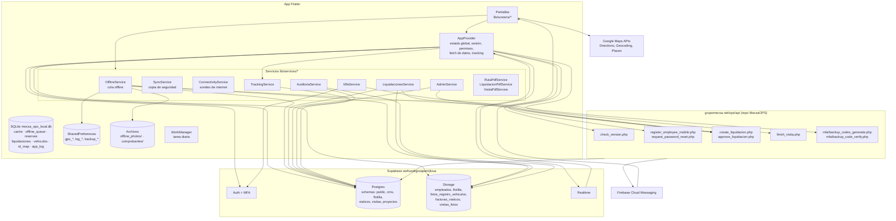
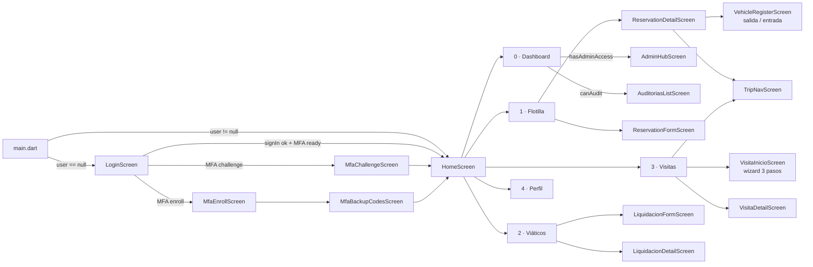
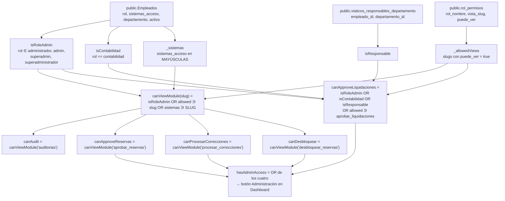
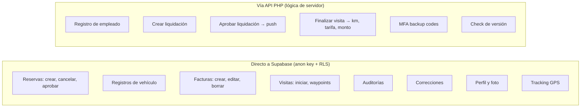

# 1. Arquitectura

## 1.1 Resumen

MecsaOPS Mobile es una app Flutter (Android e iOS) para el personal de campo de Grupo Mecsa. Cubre cinco áreas: **flotilla** (reservas y uso de vehículos), **viáticos** (liquidación de gastos), **visitas** (recorridos con pago de kilometraje), **auditorías** de vehículos y un **modo administración** para aprobar y corregir.

No tiene backend propio. Habla directamente con **Supabase** (Postgres vía PostgREST, Auth, Storage, Realtime) y, para las operaciones que necesitan lógica de servidor o notificaciones, con los **endpoints PHP** de la web de OPS (repositorio `MecsaOPS`, carpeta `api/`) publicados en `https://grupomecsa.net/ops/api/`.

## 1.2 Stack

| Capa | Tecnología | Uso |
|------|-----------|-----|
| UI | Flutter 3 (Dart SDK ^3.10) | Pantallas en `lib/screens/` |
| Estado | `provider` (`ChangeNotifier`) | Un `AppProvider` global + `OfflineService` como segundo notifier |
| Backend principal | `supabase_flutter` 2.x | Auth con email/password + MFA TOTP, tablas en varios schemas, Storage, Realtime |
| Backend secundario | HTTP (`http`) a PHP | Versionado, registro de empleados, liquidaciones, cierre de visitas, MFA backup codes |
| Push | `firebase_core` + `firebase_messaging` | Notificaciones de pago de kilometraje |
| Notificaciones locales | `flutter_local_notifications` | Aviso cuando una liquidación cambia de estado (vía Realtime) |
| Geolocalización | `geolocator`, `google_maps_flutter` | Tracking, navegación, mapas |
| Voz | `flutter_tts` | Instrucciones de navegación |
| Offline | `connectivity_plus`, `shared_preferences`, `path_provider` | Cola de sincronización |
| Documentos | `pdf`, `printing`, `gal`, `image_picker`, `share_plus` | PDF de ruta, liquidación y visita; fotos a galería |
| Datos locales | `sqflite`, `path_provider` | SQLite (caché, cola offline, reservas, liquidaciones, vehículos, log) y fotos/comprobantes en la carpeta de la app |
| Fondo | `workmanager` | Copia de seguridad programada (diaria/semanal/mensual) |
| CI | Codemagic (`codemagic.yaml`) | AAB automático en cada push a `main` |

## 1.3 Diagrama de componentes



### Navegación y animaciones

El shell (`HomeScreen`) muestra las 5 pestañas con `AnimatedTabs` ([widgets/animated_tabs.dart](../lib/widgets/animated_tabs.dart)): todas quedan montadas (como `IndexedStack`, sin perder scroll ni formularios) y el cambio hace un deslizamiento corto con desvanecido en la dirección del movimiento. Entre páginas (`Navigator.push`) el tema define `pageTransitionsTheme` con `FadeForwardsPageTransitionsBuilder` en Android y el deslizamiento nativo en iOS. Las fotos de visitas abren en `FotoViewer` ([widgets/foto_viewer.dart](../lib/widgets/foto_viewer.dart)): modal a pantalla completa con zoom, paginación, descarga a la galería y compartir.

## 1.4 Estructura de carpetas

```
lib/
├── main.dart                 # Inicializa Supabase, Firebase, OfflineService y WorkManager; decide Login vs Home
├── providers/
│   └── app_provider.dart     # Estado global (2.4k líneas): sesión, empleado, permisos, fetchData, reservas, visitas, tracking
├── services/
│   ├── local_db.dart         # SQLite: esquema y migraciones (dbVersion 4)
│   ├── offline_service.dart  # Cola offline (registros, facturas, liquidaciones, visitas)
│   ├── sync_service.dart     # Copia de seguridad manual y programada (WorkManager)
│   ├── connectivity_service.dart · cache_service.dart
│   ├── reservas_local.dart · liquidaciones_local.dart · vehiculos_local.dart
│   ├── comprobantes_service.dart · liquidacion_pdf_service.dart · visita_pdf_service.dart
│   ├── liquidaciones_service.dart
│   ├── admin_service.dart
│   ├── auditoria_service.dart
│   ├── mfa_service.dart
│   ├── tracking_service.dart # Stream GPS -> visitas.ops_tracking
│   └── ruta_pdf_service.dart
├── models/                   # reservation, liquidacion (+Factura), auditoria (+RubricaItem, AuditoriaItem)
├── screens/
│   ├── home_screen.dart      # Shell con IndexedStack de 5 pestañas + DashboardTab
│   ├── login_screen.dart, mfa_*.dart
│   ├── flotilla_screen.dart, reservation_*.dart, vehicle_register_screen.dart, trip_nav_screen.dart
│   ├── viaticos_screen.dart, liquidacion_*.dart
│   ├── visitas_screen.dart, visita_*.dart, map_picker_screen.dart
│   ├── auditorias/           # lista, formulario, detalle
│   ├── admin/                # hub, aprobar liquidaciones, aprobar reservas, correcciones, desbloquear
│   └── profile_screen.dart
├── widgets/                  # bottom_nav, correccion_widgets, etc.
├── theme/app_theme.dart
└── utils/
```

## 1.5 Navegación principal



## 1.6 Modelo de permisos

Toda la autorización se calcula en el cliente a partir de la fila del empleado en `public.Empleados` y de dos tablas auxiliares. Se resuelve en `_fetchCurrentEmployeeId()` ([app_provider.dart:111-189](../lib/providers/app_provider.dart#L111-L189)).



Además, `sistemas_acceso` contiene el token `RESERVAS_EXCEPCION` que exime del bloqueo por strikes (ver [Flotilla](03-flotilla.md#33-bloqueo-por-strikes)).

## 1.7 Ciclo de vida del estado

- `AppProvider` se crea una sola vez en `main.dart` y vive toda la sesión.
- `fetchData()` es la carga completa (con spinner). Se llama al construir el provider, al hacer login, y en cada pull-to-refresh.
- `refreshSilent()` recarga solo reservas, viáticos y visitas sin spinner. Se dispara cuando la app vuelve a primer plano.
- Al hacer `signOut` el listener de Auth limpia vehículos y proyectos y cierra el canal Realtime.
- `OfflineService` es un singleton independiente que sobrevive a login/logout.

## 1.8 Dos caminos hacia los datos

Es importante distinguir cuándo la app escribe **directo en Supabase** y cuándo pasa **por PHP**, porque solo el segundo camino dispara notificaciones y lógica de negocio del servidor.


