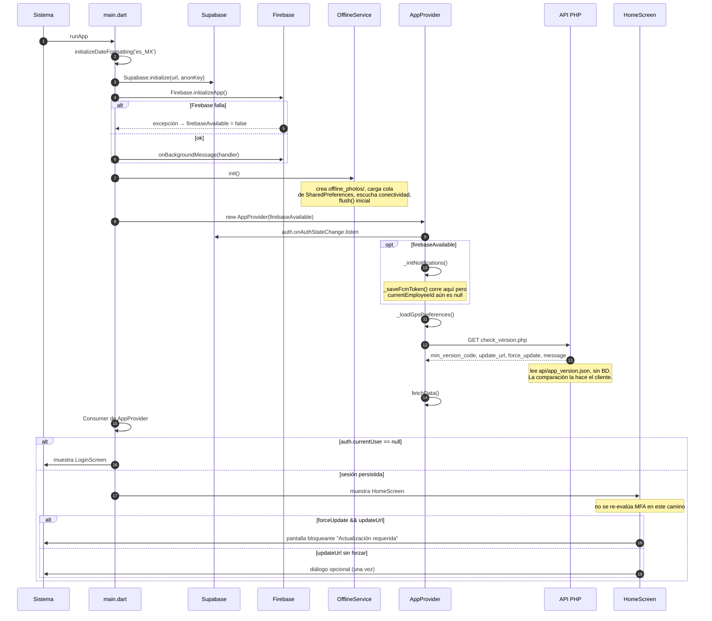
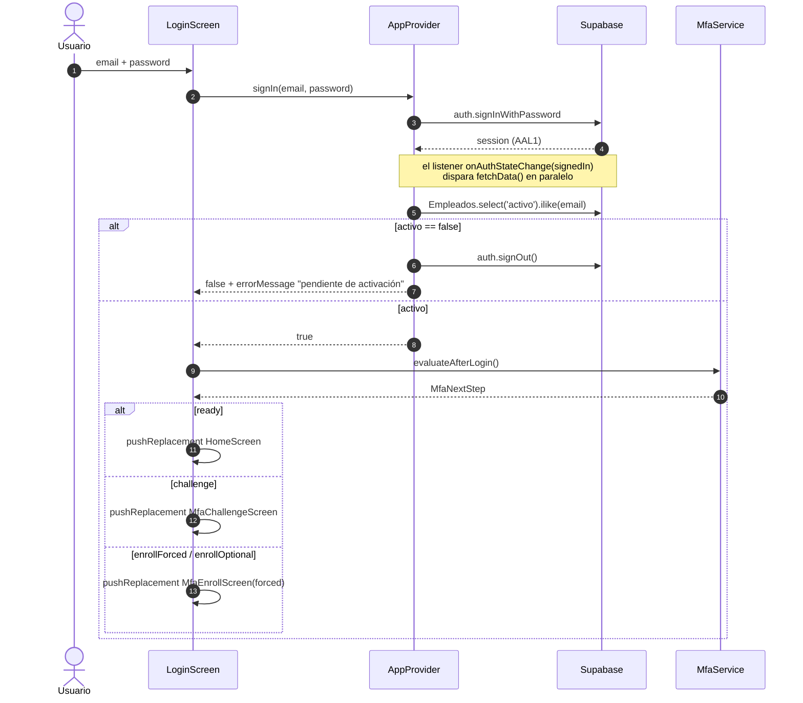
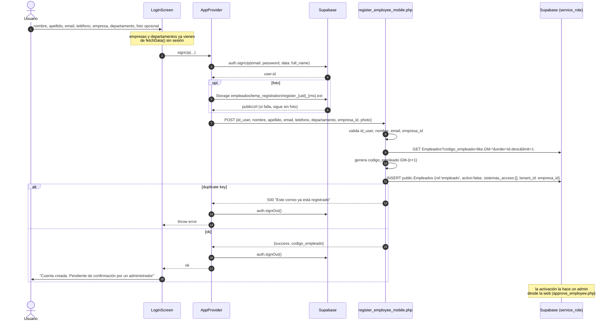
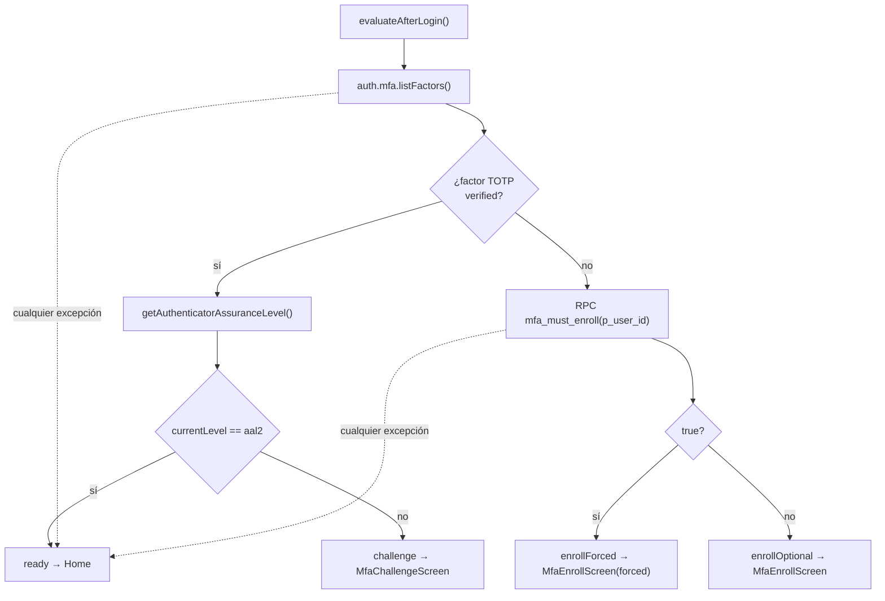
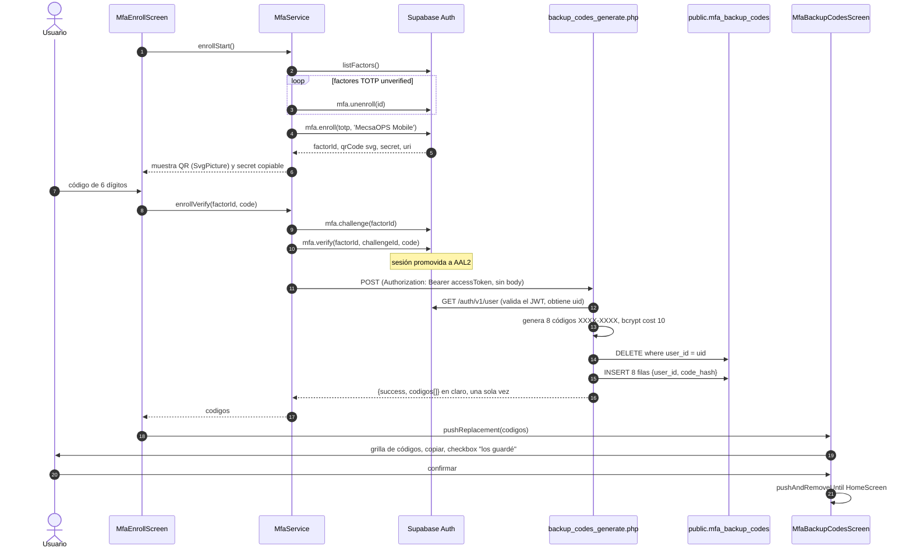
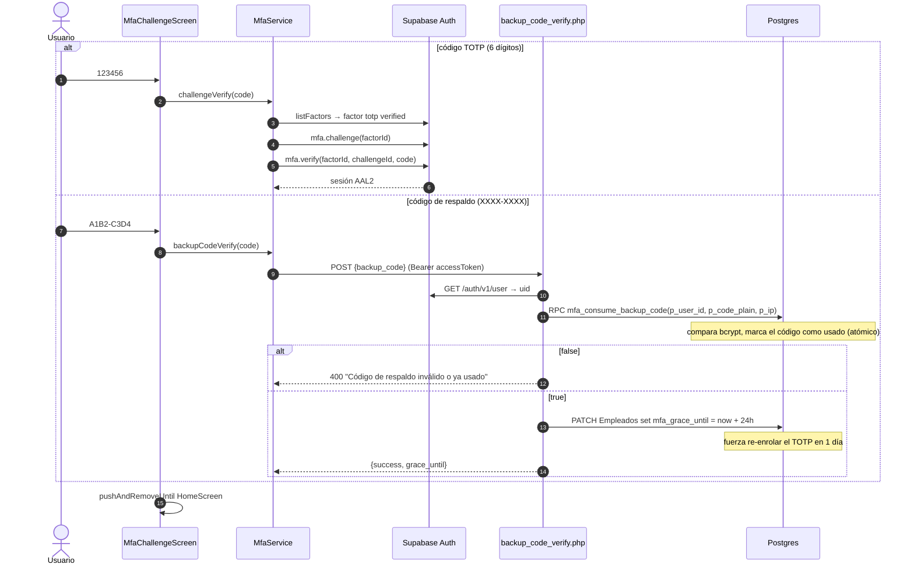
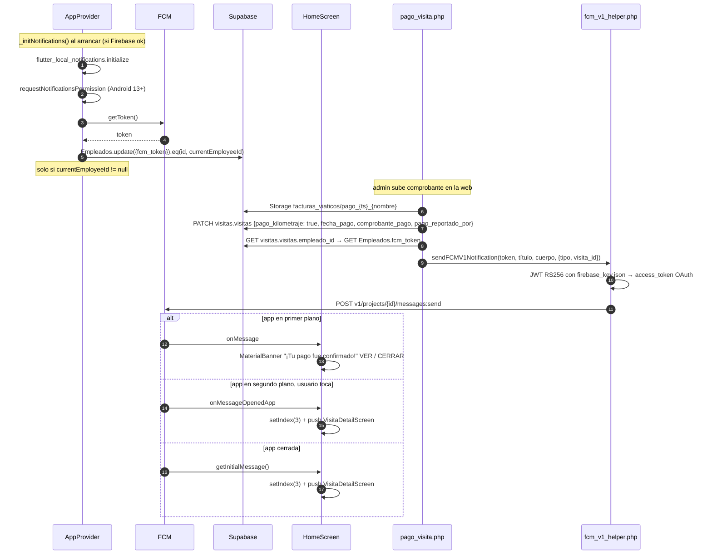
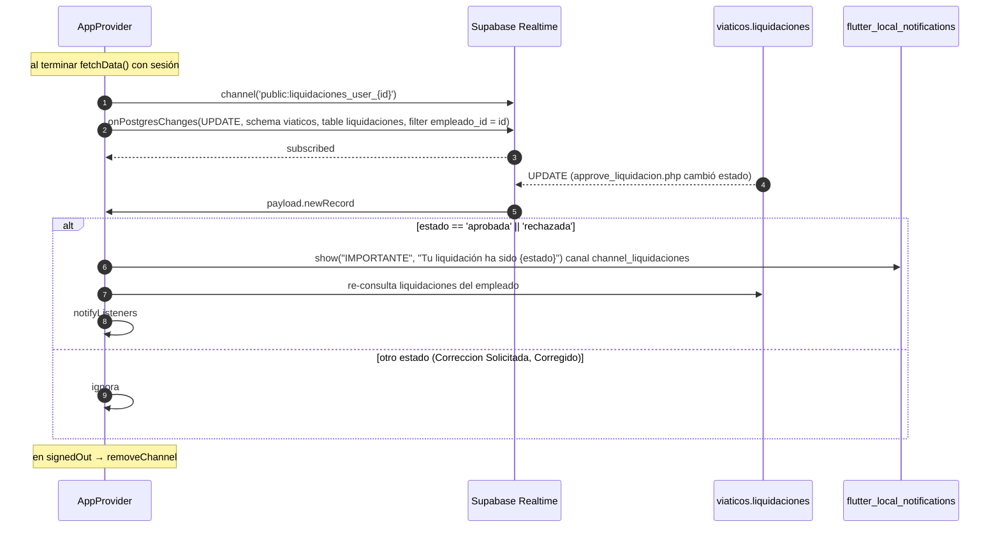

# 2. Arranque y autenticación

## 2.1 Arranque de la app

Fuente: [main.dart](../lib/main.dart), [app_provider.dart:202-253](../lib/providers/app_provider.dart#L202-L253), [home_screen.dart:188-244](../lib/screens/home_screen.dart#L188-L244). Lado servidor: `MecsaOPS/api/check_version.php`, que solo devuelve el contenido de `api/app_version.json` sin tocar la base de datos.



### `fetchData()` en detalle

```mermaid
sequenceDiagram
    autonumber
    participant Provider as AppProvider
    participant Supabase

    Provider->>Provider: isLoading = true
    par siempre, incluso sin sesión
        Provider->>Supabase: cms.departamento (id, nombre, id_empresa)
        Provider->>Supabase: public.Empresas (id, nombre_comercial)
    end
    alt user == null
        Provider-->>Provider: return (finally: isLoading=false)
    end
    Provider->>Supabase: public.Empleados ilike(email) maybeSingle
    alt activo == false
        Provider->>Supabase: auth.signOut()
        Provider-->>Provider: throw "Cuenta desactivada"
    end
    Provider->>Supabase: viaticos_responsables_departamento eq(empleado_id)
    Provider->>Supabase: rol_permisos eq(rol_nombre)
    Note over Provider: calcula isRoleAdmin, isContabilidad,<br/>_sistemas, _allowedViews, isResponsable
    par en paralelo
        Provider->>Supabase: flotilla.vehiculos
        Provider->>Supabase: viaticos.liquidaciones eq(empleado_id)
        Provider->>Supabase: visitas.visitas eq(empleado_id)
        Provider->>Supabase: proyectos.projects
        Provider->>Supabase: flotilla.reservas + vehiculos(*) eq(empleado_id)
        Provider->>Supabase: public.Empleados (id, nombre, apellido)
        Provider->>Supabase: visitas.vehiculos_personales eq(empleado_id)
    end
    Note over Provider: _fetchFlotilla y _fetchViaticos hacen rethrow;<br/>el resto traga errores
    Provider->>Provider: isLoading = false, notifyListeners
    Provider->>Supabase: Realtime channel liquidaciones_user_{id}
```

> **Sin verificación de conectividad al arrancar.** La app no hace ping ni health-check. Simplemente intenta las llamadas y, si fallan, muestra "Error de conexión". `check_version.php` y `fetchData` no tienen timeout. Ver [Observaciones](10-observaciones.md).

## 2.2 Login

Fuente: [login_screen.dart:605-686](../lib/screens/login_screen.dart#L605-L686), [app_provider.dart:340-376](../lib/providers/app_provider.dart#L340-L376).



## 2.3 Registro de cuenta

Fuente: [app_provider.dart:405-495](../lib/providers/app_provider.dart#L405-L495). Servidor: `MecsaOPS/api/register_employee_mobile.php`.



### Recuperar contraseña

`POST request_password_reset.php {email}` ([app_provider.dart:378-403](../lib/providers/app_provider.dart#L378-L403)). El servidor genera un enlace de recuperación con `auth/v1/admin/generate_link` y lo envía por SMTP propio. Si el SMTP falla, cae a `auth/v1/recover` para que Supabase envíe el correo. Siempre responde `success: true` para no revelar si el email existe.

## 2.4 MFA TOTP

Fuente: [mfa_service.dart](../lib/services/mfa_service.dart), [mfa_enroll_screen.dart](../lib/screens/mfa_enroll_screen.dart), [mfa_challenge_screen.dart](../lib/screens/mfa_challenge_screen.dart), [mfa_backup_codes_screen.dart](../lib/screens/mfa_backup_codes_screen.dart). Servidor: `MecsaOPS/api/mfa/backup_codes_generate.php`, `backup_code_verify.php`, `_bearer.php`.

### Decisión después del login



> El periodo de gracia **no vive en la app**. Lo decide la RPC `mfa_must_enroll` en Postgres, que compara `Empleados.mfa_grace_until` con la fecha actual. Un admin puede reiniciarlo a 14 días con `mfa_admin_reset_user` desde la web. Si la RPC falla, la app deja pasar al usuario.

### Enrolamiento



### Desafío al iniciar sesión



## 2.5 Notificaciones push (FCM)

Fuente app: [app_provider.dart:295-338](../lib/providers/app_provider.dart#L295-L338), [home_screen.dart:58-137](../lib/screens/home_screen.dart#L58-L137). Servidor: `MecsaOPS/api/fcm_v1_helper.php`, `pago_visita.php`, `approve_liquidacion.php`.

El servidor envía push desde dos endpoints. Solo uno de ellos incluye datos que la app interpreta:

| Endpoint | Cuándo | `notification` | `data` extra | La app lo usa |
|----------|--------|----------------|--------------|---------------|
| `pago_visita.php` | Admin confirma pago de kilometraje desde la web | "✅ Pago de Kilometraje Confirmado" | `tipo: pago_kilometraje`, `visita_id` | Sí: banner y navegación al detalle |
| `approve_liquidacion.php` | Admin aprueba o rechaza una liquidación | "Liquidación Aprobada/Rechazada" | ninguno | Solo se muestra la notificación del sistema |



## 2.6 Realtime de liquidaciones

Fuente: [app_provider.dart:1596-1667](../lib/providers/app_provider.dart#L1596-L1667).

Este es el segundo mecanismo por el que el empleado se entera de que su liquidación fue aprobada o rechazada. Funciona aunque el push FCM no llegue, porque escucha el cambio de fila directamente.


