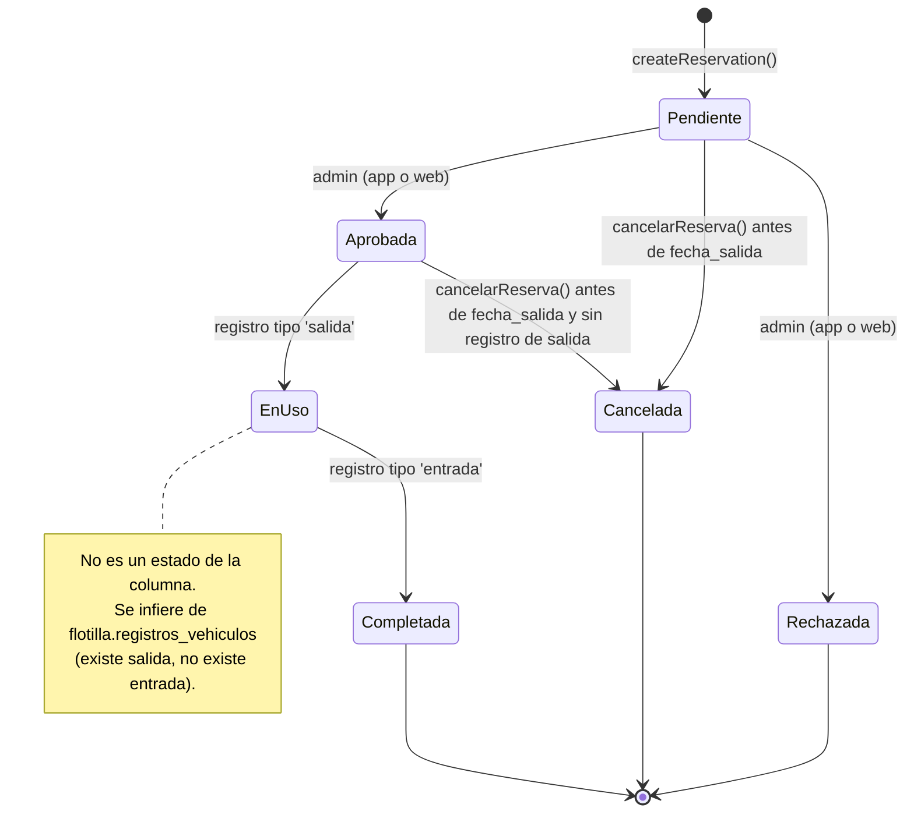
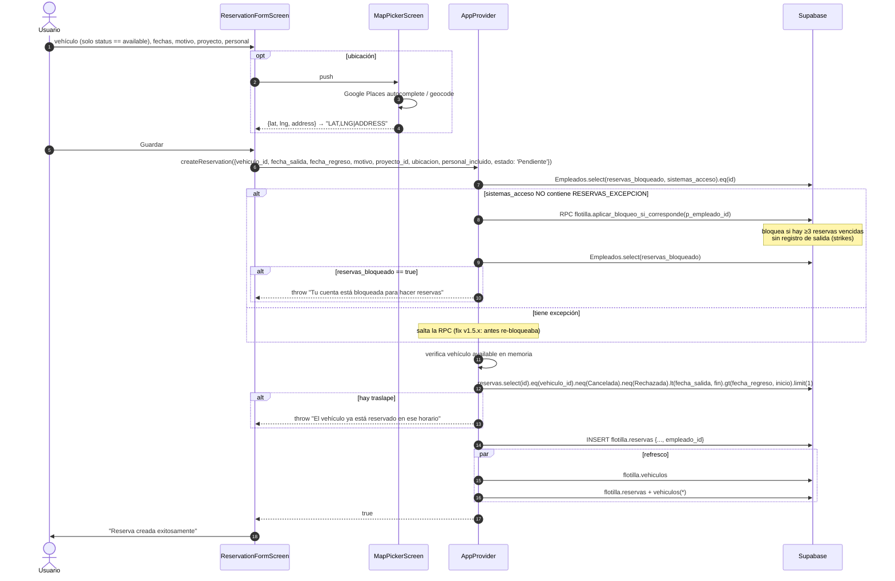
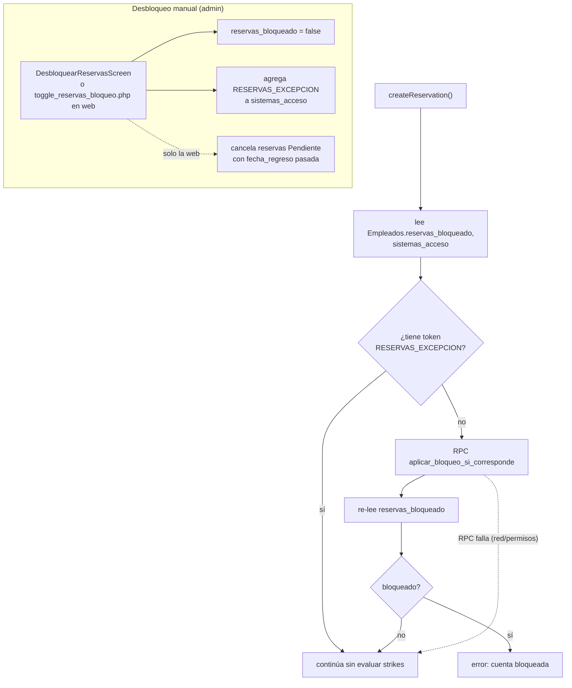
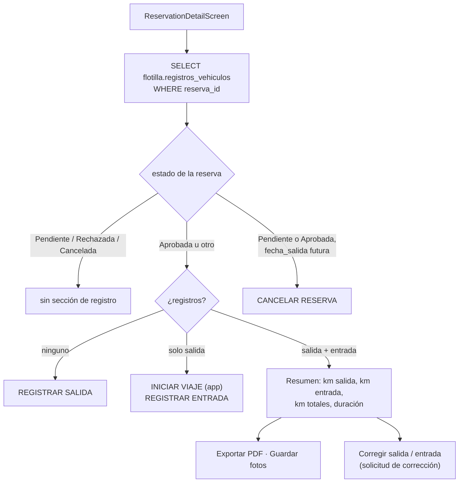
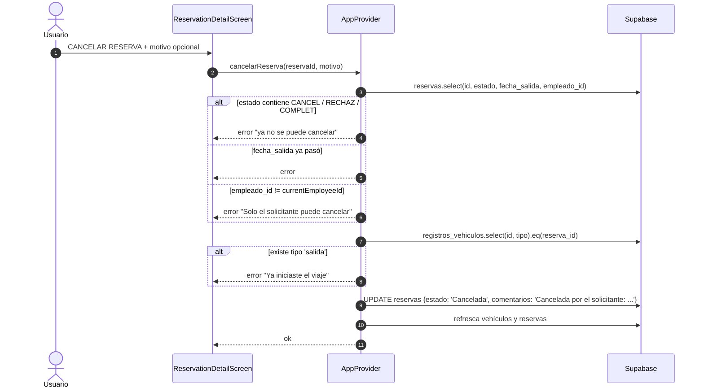
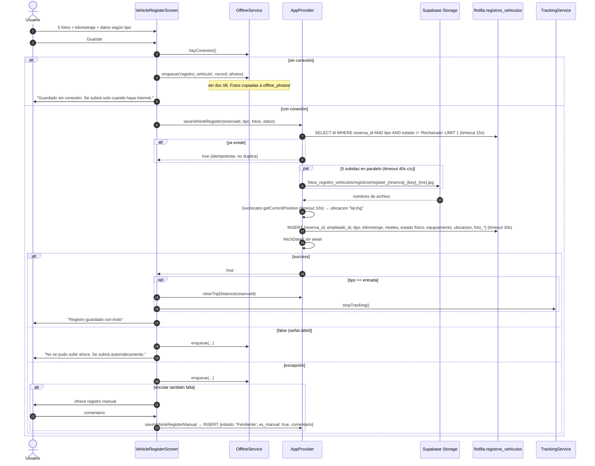
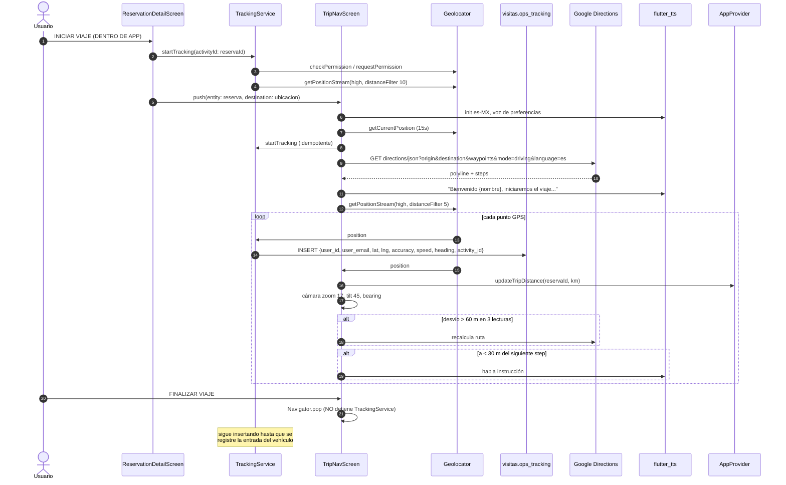
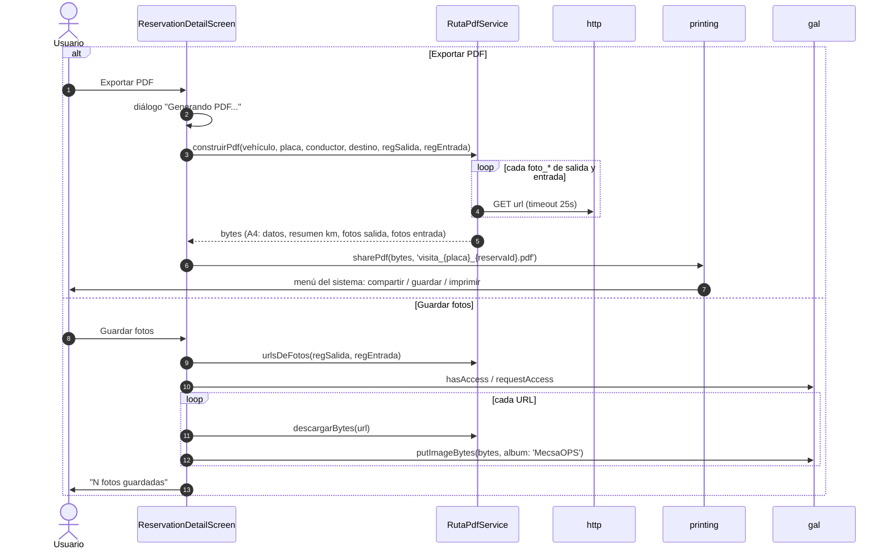

# 3. Flotilla

Módulo de reservas y uso de vehículos de la empresa. Todo el módulo escribe **directo en Supabase** (schema `flotilla`); no usa ningún endpoint PHP.

Pantallas: [flotilla_screen.dart](../lib/screens/flotilla_screen.dart), [reservation_form_screen.dart](../lib/screens/reservation_form_screen.dart), [reservation_detail_screen.dart](../lib/screens/reservation_detail_screen.dart), [vehicle_register_screen.dart](../lib/screens/vehicle_register_screen.dart), [trip_nav_screen.dart](../lib/screens/trip_nav_screen.dart).

## 3.1 Ciclo de vida de una reserva

La columna `flotilla.reservas.estado` toma los valores `Pendiente`, `Aprobada`, `Rechazada`, `Cancelada`. La interfaz compara por substring (`APROB`, `RECHAZ`, `CANCEL`, `COMPLET`).

## 3.2 Crear una reserva

Fuente: [reservation_form_screen.dart:482-519](../lib/screens/reservation_form_screen.dart#L482-L519), [app_provider.dart:1089-1212](../lib/providers/app_provider.dart#L1089-L1212).

## 3.3 Bloqueo por strikes

La regla vive en la función SQL `flotilla.aplicar_bloqueo_si_corresponde`. Un "strike" es una reserva cuya fecha de salida ya pasó y para la que el empleado nunca registró la salida del vehículo. Con tres o más, la función pone `Empleados.reservas_bloqueado = true`.

## 3.4 Detalle de reserva y acciones disponibles

Fuente: [reservation_detail_screen.dart](../lib/screens/reservation_detail_screen.dart).

### Cancelación

## 3.5 Registro de salida y entrada del vehículo

Fuente: [vehicle_register_screen.dart:114-223](../lib/screens/vehicle_register_screen.dart#L114-L223), [app_provider.dart:1356-1551](../lib/providers/app_provider.dart#L1356-L1551).

Se piden **cinco fotos obligatorias**: frente, lateral derecho, lateral izquierdo, trasera y tablero con kilometraje. En la salida se capturan además niveles de aceite y combustible, estado físico (pintura, llantas, interiores) y equipamiento (kit, refacción, compás). En la entrada el kilometraje se pre-llena con el de salida más la distancia acumulada por el GPS del viaje.

### Estados de un registro

| `estado` | Quién lo pone | Significado |
|----------|---------------|-------------|
| *(default de la tabla)* | Registro normal | Registro válido |
| `Pendiente` | Registro manual desde la app | Requiere revisión de un admin (`aprobar_registro_manual.php` en la web) |
| `Rechazado` | Admin en la web | Se ignora para la idempotencia, permite volver a registrar |
| `Correccion Solicitada` | Empleado desde el detalle de reserva | Pidió corregir kilometraje u otro dato |
| `Corregido` | Admin desde la app o la web | Corrección aplicada |

## 3.6 Navegación del viaje y tracking GPS

Fuente: [trip_nav_screen.dart](../lib/screens/trip_nav_screen.dart), [tracking_service.dart](../lib/services/tracking_service.dart).

Hay **dos streams de GPS independientes** mientras dura un viaje:

| Stream | Dónde | `distanceFilter` | Qué hace |
|--------|-------|------------------|----------|
| `TrackingService` | Provider, persiste toda la sesión | 10 m | INSERT en `visitas.ops_tracking` por cada punto |
| `TripNavScreen` local | Solo mientras la pantalla está abierta | 5 m | Acumula distancia en memoria, mueve la cámara, recalcula ruta, habla instrucciones |

## 3.7 PDF del registro de ruta y fotos

Fuente: [reservation_detail_screen.dart:455-573](../lib/screens/reservation_detail_screen.dart#L455-L573), [ruta_pdf_service.dart](../lib/services/ruta_pdf_service.dart).

Disponible solo cuando la reserva tiene registro de salida y de entrada.

> Las columnas `foto_*` guardan solo el **nombre de archivo**, pero el servicio de PDF hace `http.get` asumiendo una URL absoluta. Ver [Observaciones](10-observaciones.md).

## 3.8 Vehículos personales

Aunque `fetchPersonalVehicles` vive en el provider junto con la flotilla, los vehículos personales pertenecen al módulo de **Visitas**: son los vehículos propios del empleado con los que hace recorridos que luego se pagan por kilometraje. Tabla `visitas.vehiculos_personales` con `alias`, `antiguedad`, `tipo`, `combustible`. Ver [Visitas](05-visitas.md).
