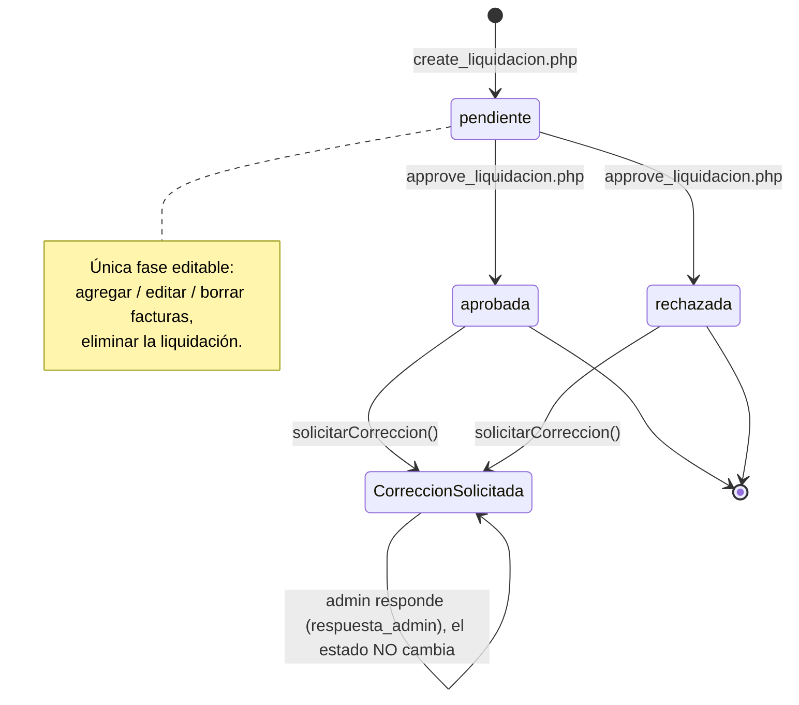
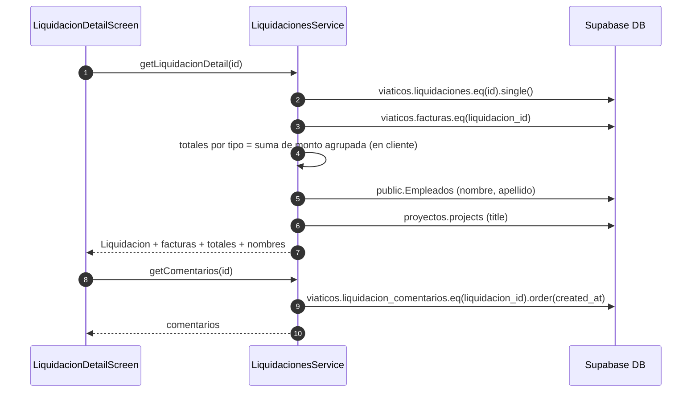
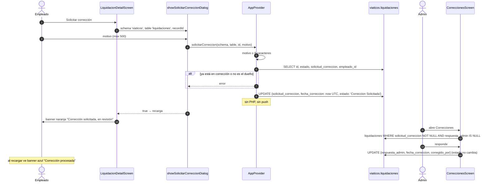
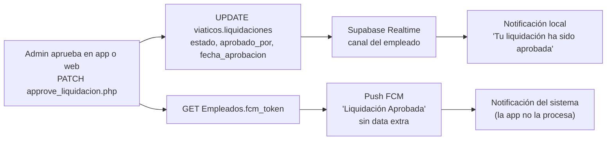

# 4. Viáticos

Módulo de liquidación de gastos. Una **liquidación** agrupa varias **facturas** (comprobantes) de un empleado, opcionalmente asociadas a un proyecto. El admin, contabilidad o el responsable del departamento la aprueba o rechaza.

Pantallas: [viaticos_screen.dart](../lib/screens/viaticos_screen.dart), [liquidacion_form_screen.dart](../lib/screens/liquidacion_form_screen.dart), [liquidacion_detail_screen.dart](../lib/screens/liquidacion_detail_screen.dart). Servicio: [liquidaciones_service.dart](../lib/services/liquidaciones_service.dart). Servidor: `MecsaOPS/api/create_liquidacion.php`, `approve_liquidacion.php`.

## 4.1 Ciclo de vida



Valores de `viaticos.liquidaciones.estado`: `pendiente`, `aprobada`, `rechazada`, `Correccion Solicitada`. Tipos de liquidación: `VIATICOS`, `COMBUSTIBLE`, `OTROS`. Tipos de factura: `D` desayuno, `A` almuerzo, `C` cena, `H` hospedaje, `COMBUSTIBLE`, `OTROS`.

## 4.2 Crear una liquidación con facturas

Fuente: [liquidacion_form_screen.dart:499-714](../lib/screens/liquidacion_form_screen.dart#L499-L714), [liquidaciones_service.dart:198-287](../lib/services/liquidaciones_service.dart#L198-L287).

```mermaid
sequenceDiagram
    autonumber
    actor U as Usuario
    participant UI as LiquidacionFormScreen
    participant Svc as LiquidacionesService
    participant Offline as OfflineService
    participant Storage as Supabase Storage
    participant PHP as create_liquidacion.php
    participant DB as Supabase DB
    participant Bitrix as Bitrix24

    UI->>Svc: getEmpleados() + getProyectos()
    Svc->>DB: public.Empleados (id, nombre, apellido)
    Svc->>DB: proyectos.projects paginado range(0,999), range(1000,1999)...
    Note over Svc: bucle hasta que una página traiga < 1000<br/>(fix: PostgREST truncaba a 1000)

    loop por cada factura
        U->>UI: tipo, proveedor, número, monto, fecha, foto
        UI->>Offline: hayConexion()
        alt con conexión
            UI->>Storage: facturas_viaticos/{ms}_{nombre} (upsert)
            Storage-->>UI: nombre de archivo → Factura.documento
        else sin conexión
            UI->>UI: Factura.localDocPath (transitorio)
        end
        UI->>UI: agrega a lista en memoria, recalcula total
    end

    U->>UI: Guardar
    UI->>UI: valida form; si no hay proyecto, descripción ≥ 15 caracteres
    UI->>UI: exige ≥ 1 factura
    UI->>Offline: hayConexion()

    alt sin conexión (solo liquidación nueva)
        Note over UI: el formulario muestra un banner naranja;<br/>personal y últimos 100 proyectos vienen de la caché
        UI->>SQLite: LiquidacionesLocal.guardarPendiente(local-id, liq, facturas)
        UI->>Offline: enqueue('liquidacion', localId, record: toJson(), children: facturas con fotos)
        UI->>U: "Se subirá cuando haya internet" (aparece en la lista como pendiente)
        Note over Offline: al reconectar ejecuta el mismo camino de abajo
    else con conexión
        UI->>Svc: createLiquidacion(liq)
        Svc->>PHP: POST {empleado_id, fecha, tarjeta_ult4, proyecto_id, tipo, personal_incluido, total, descripcion}
        PHP->>DB: GET Empleados?id=eq → existe
        opt proyecto_id
            PHP->>DB: GET proyectos.projects?project_id=eq → existe
        end
        alt sin proyecto y descripción < 15 chars
            PHP-->>Svc: 400 {error, field: 'descripcion'}
            Svc-->>UI: mensaje legible del servidor
        end
        PHP->>DB: INSERT viaticos.liquidaciones {estado: 'pendiente', tipo default VIATICOS} (service_role)
        PHP-->>Svc: {success, data: fila}
        PHP->>DB: waba_crm.integrations_config platform=liquidation_notifications
        PHP->>Bitrix: im.notify.system.add a cada bitrix_user_id
        Note over PHP,Bitrix: después del echo, try/catch silencioso.<br/>No hay push FCM al crear.
        loop cada factura sin id
            Svc->>DB: INSERT viaticos.facturas {liquidacion_id, tipo, proveedor, numero_factura, monto, fecha, documento}
        end
        Note over Svc: sin transacción: si falla una factura,<br/>la liquidación ya quedó creada
        UI->>U: pop(true) → ViaticosScreen recarga
    end
```

## 4.3 Detalle de liquidación

`getLiquidacionDetail(id)` consulta el servidor con red y actualiza la fila en SQLite; sin red (o con id `local-…`) la lee de la tabla `liquidaciones`, recalculando los totales por tipo desde sus facturas. Al abrir el detalle con red, `ComprobantesService.precargar()` descarga los comprobantes a `<documentos>/comprobantes/`.

- **Ver comprobante**: `ComprobanteViewerScreen` dentro de la app (zoom); usa la caché o la foto local de una factura pendiente de subir. Los PDF se abren con la app externa.
- **Exportar PDF** (icono en la barra): `LiquidacionPdfService.construir()` arma datos generales, tabla de facturas, totales y una página por comprobante, y `Printing.sharePdf` abre el menú de compartir. Funciona sin red con lo que haya en caché.

Fuente: [liquidacion_detail_screen.dart](../lib/screens/liquidacion_detail_screen.dart), [liquidaciones_service.dart:136-195](../lib/services/liquidaciones_service.dart#L136-L195).



Acciones según estado:

| Acción | Condición | Qué hace |
|--------|-----------|----------|
| Agregar / editar / eliminar factura | `estado == 'pendiente'` | INSERT / UPDATE / DELETE directo en `viaticos.facturas`. Sin conexión solo se puede agregar (se encola tipo `factura`) |
| Eliminar liquidación | `estado == 'pendiente'` | DELETE en `viaticos.liquidaciones` |
| Comentar | siempre | INSERT en `viaticos.liquidacion_comentarios` |
| Ver comprobante | siempre | Abre `storage/v1/object/public/facturas_viaticos/{documento}` en el navegador |
| Solicitar corrección | `estado != 'pendiente'` y sin `solicitud_correccion` | Ver 4.4 |

## 4.4 Solicitar corrección

Fuente: [correccion_widgets.dart](../lib/widgets/correccion_widgets.dart), [app_provider.dart:1300-1354](../lib/providers/app_provider.dart#L1300-L1354). El mismo widget se usa para corregir registros de kilometraje en Flotilla.



## 4.5 Listado de viáticos

Con red pagina contra Supabase (20 por página). Sin red muestra las del último mes guardadas en SQLite con un aviso "mostrando liquidaciones guardadas", sin paginación. Las creadas sin conexión (`esLocal`) van siempre primero con icono de nube; al tocarlas se abre un resumen local en vez del detalle remoto. Las liquidaciones del último mes se bajan al iniciar sesión (`_fetchViaticos`, `fecha >= hoy - 30 días`, con sus facturas en una sola consulta `inFilter`) y en cada copia de seguridad.

Fuente: [viaticos_screen.dart](../lib/screens/viaticos_screen.dart), [liquidaciones_service.dart:13-133](../lib/services/liquidaciones_service.dart#L13-L133).

- Filtros por chip: todos, pendiente, aprobada, rechazada.
- Consulta `viaticos.liquidaciones` por `empleado_id`, orden `created_at desc`, con `range` de 20 y `count exact`.
- Hidrata nombres de empleado y proyecto con dos consultas `inFilter` en lote (no N+1).
- La paginación está declarada pero no avanza: `currentPage` nunca se incrementa. Ver [Observaciones](10-observaciones.md).
- Pull-to-refresh recarga `fetchData()` del provider y la lista.

## 4.6 Cómo se entera el empleado del resultado



El empleado puede recibir **dos avisos** por el mismo evento: uno local generado por Realtime y otro push desde el servidor.

## 4.7 Historial de liquidaciones

`LiquidacionesHistorialScreen` (botón "historial" junto al "+" de Viáticos) busca en `viaticos.liquidaciones` con filtros de texto (`descripcion`, `personal_incluido`, `tarjeta_ult4` vía `ilike`), estado, tipo y rango de `fecha`, paginado de 30. Un usuario normal ve solo `empleado_id = propio`; un admin (`isRoleAdmin`) ve todas y la tarjeta muestra el empleado (nombres en lote desde `Empleados`) y el proyecto (`proyectos.projects`). Abre `LiquidacionDetailScreen(soloLectura: true)`: sin eliminar, sin agregar/editar facturas, sin solicitar corrección ni comentar; sí permite ver comprobantes y exportar el PDF. Sin red muestra las del último mes guardadas en SQLite.
