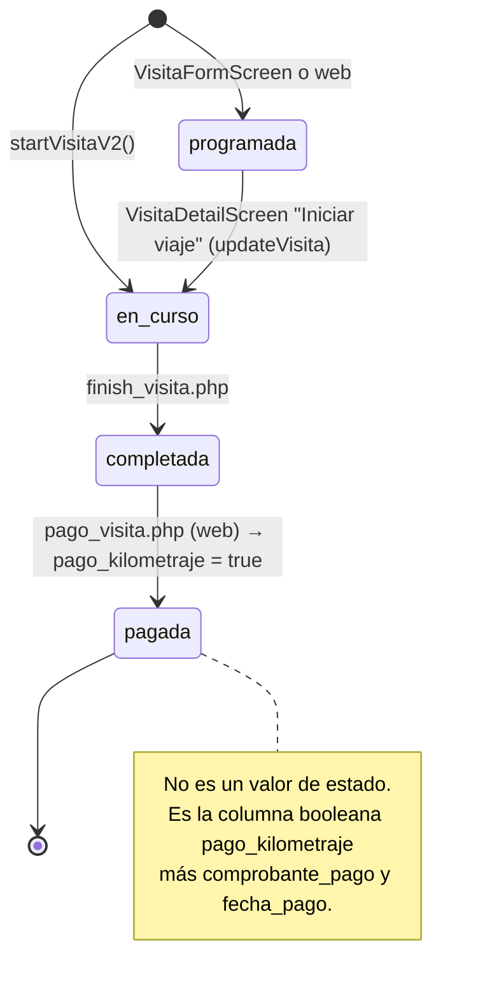
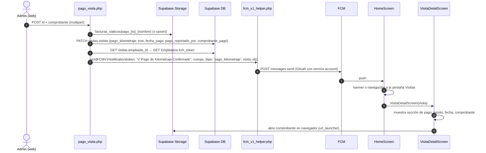

# 5. Visitas

Módulo para registrar recorridos de trabajo hechos con el **vehículo personal** del empleado. Al cerrar la visita el servidor calcula los kilómetros, aplica un tarifario y guarda el monto a pagar. Cuando un admin confirma el pago desde la web, la app recibe un push.

Pantallas: [visitas_screen.dart](../lib/screens/visitas_screen.dart), [visita_inicio_screen.dart](../lib/screens/visita_inicio_screen.dart), [visita_detail_screen.dart](../lib/screens/visita_detail_screen.dart). Servidor: `MecsaOPS/api/finish_visita.php`, `pago_visita.php`, `includes/tarifario_kilometraje.php`.

## 5.1 Qué es una visita y qué es una ruta

Todo vive en la tabla `visitas.visitas`. No existe una tabla `rutas`.

| Concepto | Cómo se ve en la tabla | Quién la crea |
|----------|------------------------|---------------|
| Visita en ruta (flujo actual, V2) | `tipo_visita = 'ruta'`, `cliente = 'En ruta'`, `waypoints[]`, `vehiculo_id`, `odometro_inicial` | `VisitaInicioScreen` → `startVisitaV2` |
| Visita programada a cliente | `cliente`, `direccion`, `lat/lng`, `tipo_visita ∈ cliente/prospecto/seguimiento`, `destinos[]` | `VisitaFormScreen` (pantalla huérfana, sin navegación actual) o la web |
| Ruta multi-parada de navegación | No se guarda. Es seleccionar varias visitas en la lista y abrir `TripNavScreen` con waypoints | `VisitasScreen` (long-press) |

`rutasActivas` en el dashboard cuenta las visitas con `estado == 'en_curso'`.

## 5.2 Ciclo de vida



## 5.3 Wizard de visita en ruta (3 pasos)

Fuente: [visita_inicio_screen.dart](../lib/screens/visita_inicio_screen.dart), [app_provider.dart:852-983](../lib/providers/app_provider.dart#L852-L983).

```mermaid
sequenceDiagram
    autonumber
    actor U as Usuario
    participant UI as VisitaInicioScreen
    participant Provider as AppProvider
    participant Geo as Geolocator
    participant Storage as Supabase Storage
    participant DB as visitas.visitas
    participant Track as TrackingService
    participant OT as visitas.ops_tracking
    participant PHP as finish_visita.php

    rect rgb(235, 245, 255)
        Note over UI: PASO 1 · Inicio
        UI->>Geo: getCurrentPosition (15s)
        UI->>Provider: personalVehicles (visitas.vehiculos_personales)
        opt nuevo vehículo
            U->>UI: alias, antigüedad, tipo, combustible
            UI->>Provider: registerPersonalVehicle → INSERT vehiculos_personales
        end
        U->>UI: vehículo, odómetro inicial, foto del odómetro (obligatoria)
        U->>UI: Iniciar viaje
        UI->>Provider: startVisitaV2(lat, lng, odometro, vehiculoId, foto)
        Provider->>Storage: visitas_fotos/visitas/visita_{ms}.jpg
        Storage-->>Provider: publicUrl
        Provider->>DB: INSERT {empleado_id, estado: 'en_curso', fecha, hora_inicio, lat, lng, vehiculo_id, odometro_inicial, foto_odometro_inicio, cliente: 'En ruta', tipo_visita: 'ruta', waypoints: []} returning id
        Provider-->>UI: visitaId
        UI->>Track: startTracking(activityId: visitaId)
    end

    rect rgb(240, 255, 240)
        Note over UI: PASO 2 · En ruta
        UI->>Geo: getPositionStream(high, distanceFilter 10)
        loop cada posición
            Geo->>UI: position
            UI->>UI: agrega waypoint {lat, lng, ts}, redibuja polilínea
            alt waypoints % 8 == 0
                UI->>Provider: updateVisitaWaypointsV2(id, waypoints)
                Provider->>DB: UPDATE {waypoints}
            end
            Geo->>Track: position (stream independiente)
            Track->>OT: INSERT {user_id, lat, lng, speed, heading, activity_id: visitaId}
        end
        U->>UI: Finalizar visita
        UI->>UI: cancela stream y timer, guarda waypoints
    end

    rect rgb(255, 245, 235)
        Note over UI: PASO 3 · Cierre
        U->>UI: odómetro final, foto final, observaciones (obligatorias), proyectos visitados
        UI->>Provider: finishVisitaV2(id, odometroFinal, obs, proyectos, waypoints, foto)
        opt foto nueva
            Provider->>Storage: visitas_fotos/visitas/visita_{ms}.jpg
        end
        Provider->>PHP: POST {id, odometro_final, observaciones, proyectos_visitados[], waypoints[], foto_odometro_url}
        PHP->>DB: GET hora_inicio, odometro_inicial, empleado_id, vehiculo_id
        PHP->>PHP: km_recorridos = max(0, final - inicial)
        PHP->>DB: GET vehiculos_personales (antiguedad, tipo, combustible)
        PHP->>PHP: tarifa = obtenerTarifaKilometraje(antiguedad, tipo, combustible)
        PHP->>PHP: monto_pago_km = km × tarifa; duracion_minutos desde hora_inicio
        PHP->>DB: PATCH {estado: 'completada', hora_fin, odometro_final, km_recorridos, duracion_minutos, foto_odometro_fin, waypoints, proyectos_visitados, observaciones, tarifa_aplicada, monto_pago_km}
        PHP-->>Provider: {success, km_recorridos, duracion_minutos}
        Provider->>DB: re-consulta visitas del empleado
        Provider-->>UI: ok
        UI->>Track: stopTracking()
        UI->>U: diálogo "¡Visita completada!" duración, distancia, puntos GPS, monto
    end
```

> Durante el paso 2 corren **dos streams de GPS** a la vez: el de la pantalla (waypoints en la columna `waypoints`) y el de `TrackingService` (puntos en `visitas.ops_tracking`). Ambos usan `distanceFilter: 10`.

### Tarifario de kilometraje

La tarifa (colones por km) vive en `MecsaOPS/includes/tarifario_kilometraje.php` como una matriz fija por **tipo de vehículo** (rural, liviano, motocicleta, híbrido, eléctrico) × **combustible** × **antigüedad** (0 a 10 años, con tope). Se aplica solo si la visita tiene `vehiculo_id` y `km_recorridos > 0`.

## 5.4 Reanudar una visita en curso

Si la app se cierra durante el paso 2, al volver a abrir la lista de visitas y tocar una con `estado == 'en_curso'`, `VisitaInicioScreen` recibe `visitaExistente`, reconstruye los `waypoints` guardados, recalcula el cronómetro desde `hora_inicio` y salta directo al paso 2 reactivando ambos streams.

## 5.5 Pago de kilometraje

Fuente app: [visita_detail_screen.dart:274-446](../lib/screens/visita_detail_screen.dart#L274-L446), [home_screen.dart:58-137](../lib/screens/home_screen.dart#L58-L137). Servidor: `pago_visita.php`.



## 5.6 Detalle de visita

`VisitaDetailScreen` no consulta la base de datos. Trabaja sobre el mapa recibido de la lista. Muestra mapa estático, fotos (`fotos[]`, odómetro inicio y fin), timeline de destinos si existen, y acciones según estado:

| Estado | Acciones |
|--------|----------|
| `programada` | Iniciar viaje: pide km inicial, hace `updateVisita {estado: en_curso, km_inicial, hora_inicio}` y abre `TripNavScreen` |
| `en_curso` | Ver mapa (`TripNavScreen`) y Finalizar (abre `VisitaInicioScreen` con `visitaExistente`) |
| `completada` | Kilometraje, duración y sección de pago |
