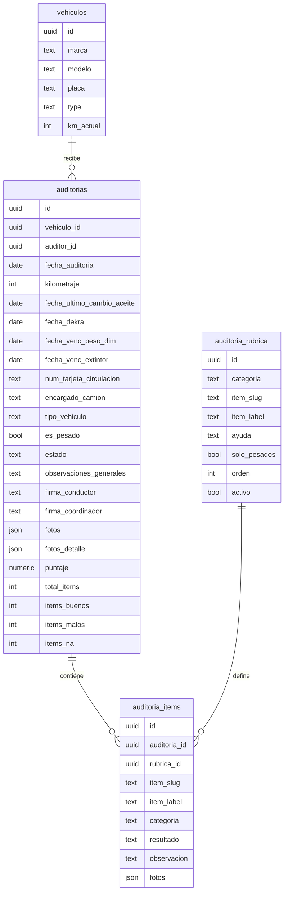
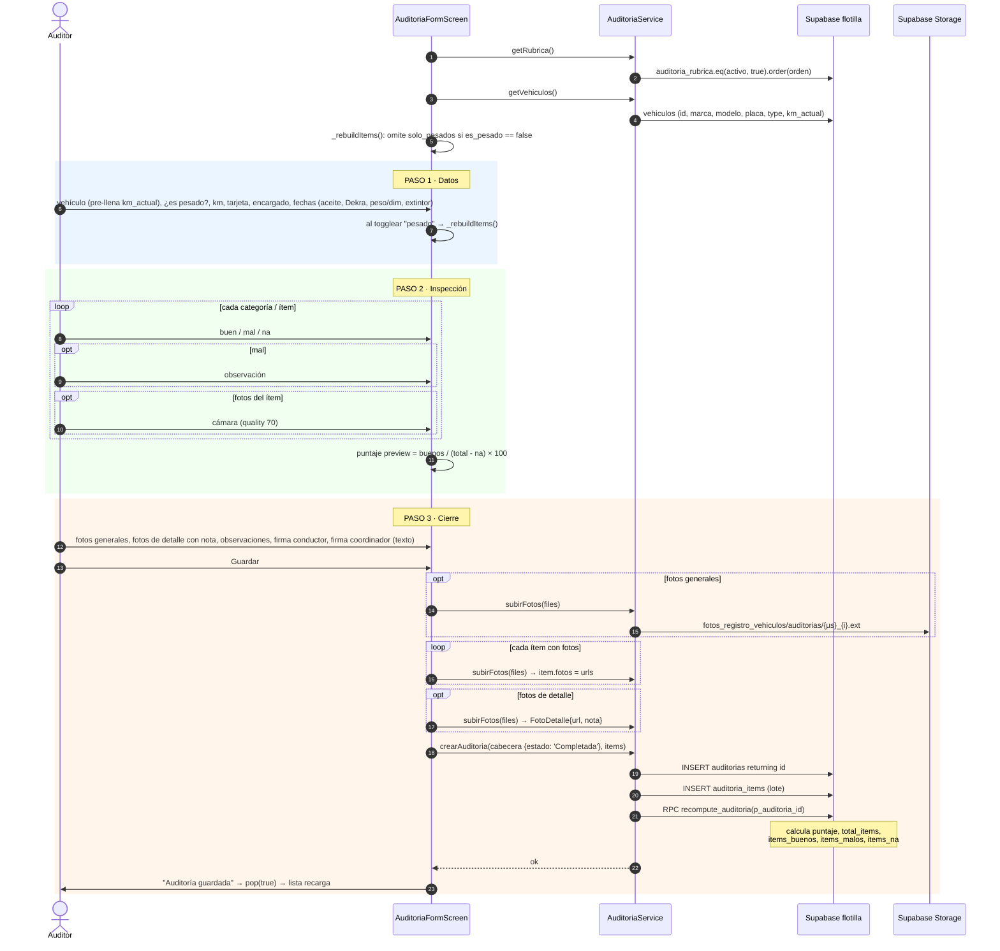
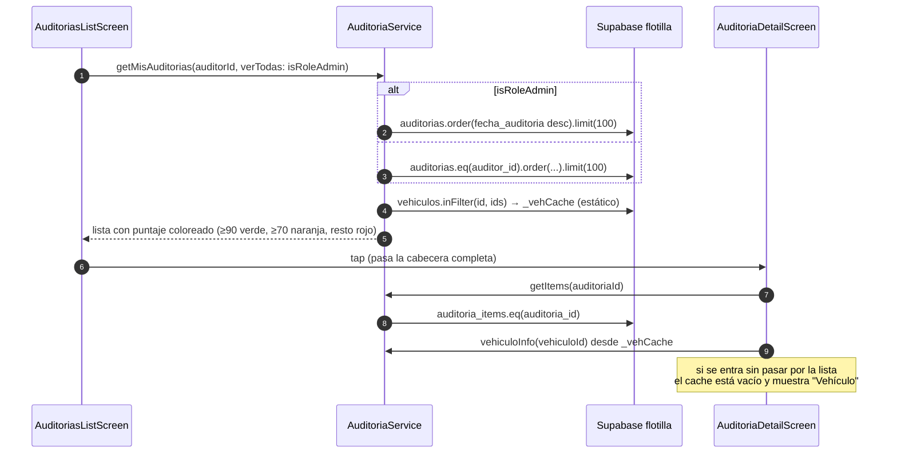

# 6. Auditorías de vehículos

Inspección de un vehículo de la flotilla contra una **rúbrica** de ítems. El resultado es un porcentaje de ítems en buen estado, calculado en la base de datos.

Pantallas: [auditorias/](../lib/screens/auditorias/). Servicio: [auditoria_service.dart](../lib/services/auditoria_service.dart). Modelo: [auditoria.dart](../lib/models/auditoria.dart). Todo va **directo a Supabase**, schema `flotilla`, sin PHP.

Acceso: botón "Auditoría de Vehículo" en el Dashboard, visible si `canAudit` (rol admin, permiso `auditorias` en `rol_permisos`, o token `AUDITORIAS` en `sistemas_acceso`).

## 6.1 Modelo

`resultado` de cada ítem: `buen`, `mal` o `na`. Los `na` se excluyen del denominador del puntaje. `estado` de la auditoría: la app siempre inserta `Completada`; `Borrador` existe solo como default del modelo.

## 6.2 Crear una auditoría

Fuente: [auditoria_form_screen.dart](../lib/screens/auditorias/auditoria_form_screen.dart), [auditoria_service.dart:57-82](../lib/services/auditoria_service.dart#L57-L82).

## 6.3 Lista y detalle

Solo los usuarios con rol admin ven todas las auditorías. Un usuario con permiso `auditorias` pero sin rol admin ve únicamente las suyas.
