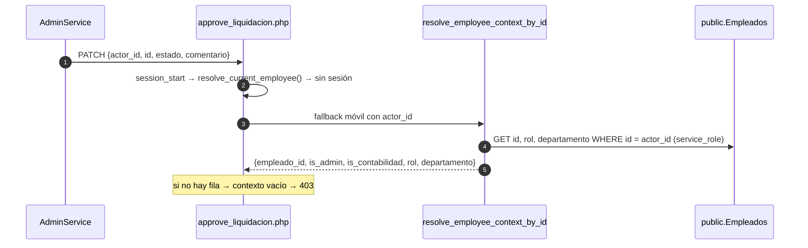
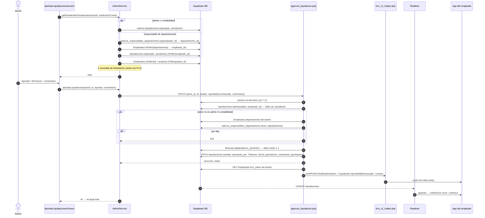
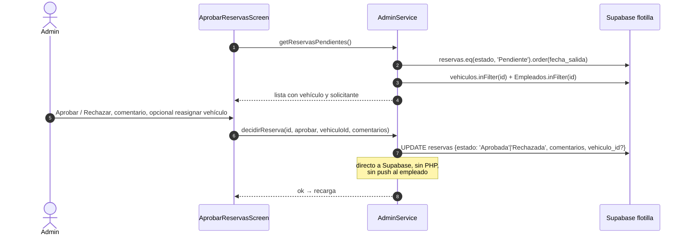
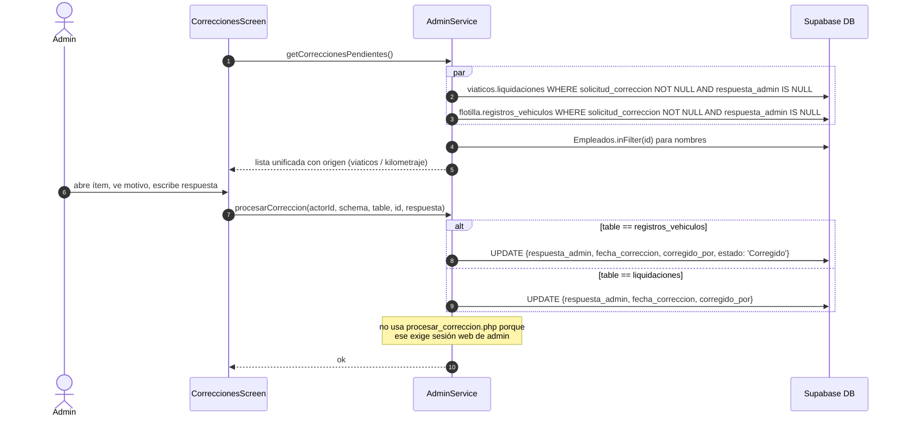

# 7. Administración

Modo administración dentro de la app (desde v1.5.0). Permite a los usuarios con permisos aprobar liquidaciones y reservas, responder solicitudes de corrección y desbloquear empleados sin ir a la web.

Pantallas: [admin/](../lib/screens/admin/). Servicio: [admin_service.dart](../lib/services/admin_service.dart). Servidor: `MecsaOPS/api/approve_liquidacion.php`, `includes/resolve_current_employee.php`.

## 7.1 Quién ve qué

El botón de Administración aparece en el Dashboard si `hasAdminAccess`. El hub muestra de cero a cuatro tarjetas según los permisos calculados en el arranque (ver [Arquitectura 1.6](01-arquitectura.md#16-modelo-de-permisos)).

| Tarjeta | Permiso | Fuente del permiso |
|---------|---------|--------------------|
| Aprobar liquidaciones | `canApproveLiquidaciones` | rol admin, rol contabilidad, responsable de departamento, o `rol_permisos.aprobar_liquidaciones` |
| Aprobar reservas | `canApproveReservas` | `canViewModule('aprobar_reservas')` |
| Correcciones | `canProcesarCorrecciones` | `canViewModule('procesar_correcciones')` |
| Desbloquear reservas | `canDesbloquear` | `canViewModule('desbloquear_reservas')` |

## 7.2 Modelo de confianza con el servidor

La app móvil no tiene sesión PHP. Para las acciones que pasan por el servidor envía `actor_id` (el UUID del empleado) y el servidor **re-lee el rol desde la base de datos** con service_role. El cliente nunca declara su rol.



> No se valida el JWT de Supabase en este camino. Quien conozca el UUID de un admin podría usarlo. Ver [Observaciones](10-observaciones.md).

## 7.3 Aprobar o rechazar liquidaciones

Fuente: [aprobar_liquidaciones_screen.dart](../lib/screens/admin/aprobar_liquidaciones_screen.dart), [admin_service.dart:24-140](../lib/services/admin_service.dart#L24-L140).



> Desde la app móvil `aprobado_por` queda como `'Sistema'` porque el servidor lo toma de `$_SESSION['nombre']`, que no existe sin sesión web.

## 7.4 Aprobar o rechazar reservas

Fuente: [aprobar_reservas_screen.dart](../lib/screens/admin/aprobar_reservas_screen.dart), [admin_service.dart:143-205](../lib/services/admin_service.dart#L143-L205).



## 7.5 Correcciones

Fuente: [correcciones_screen.dart](../lib/screens/admin/correcciones_screen.dart), [admin_service.dart:209-279](../lib/services/admin_service.dart#L209-L279).



La app **no modifica el dato corregido** (kilometraje, total). Solo registra la respuesta. La corrección real del valor la hace el admin en la web, donde `procesar_correccion.php` admite `extra_update` con campos permitidos.

## 7.6 Desbloquear reservas

Fuente: [desbloquear_reservas_screen.dart](../lib/screens/admin/desbloquear_reservas_screen.dart), [admin_service.dart:282-306](../lib/services/admin_service.dart#L282-L306).

```mermaid
sequenceDiagram
    autonumber
    actor A as Admin
    participant UI as DesbloquearReservasScreen
    participant Svc as AdminService
    participant DB as public.Empleados

    UI->>Svc: getEmpleadosBloqueados()
    Svc->>DB: SELECT id, nombre, apellido, reservas_bloqueado, sistemas_acceso WHERE reservas_bloqueado = true
    A->>UI: Desbloquear
    UI->>Svc: desbloquearEmpleado(id)
    Svc->>DB: SELECT sistemas_acceso
    Svc->>Svc: agrega 'RESERVAS_EXCEPCION' si no está
    Svc->>DB: UPDATE {reservas_bloqueado: false, sistemas_acceso}
    Note over Svc: la web además cancela las reservas<br/>Pendiente vencidas; la app no
    Svc-->>UI: ok
```

## 7.7 Comparación app vs web

| Acción | App móvil | Web (MecsaOPS) | Diferencia |
|--------|-----------|----------------|------------|
| Aprobar liquidación | `approve_liquidacion.php` con `actor_id` | Mismo endpoint con sesión | `aprobado_por` = 'Sistema' desde la app |
| Aprobar reserva | UPDATE directo | UPDATE directo | Ninguna |
| Procesar corrección | UPDATE directo, solo respuesta | `procesar_correccion.php` con `extra_update` | La web puede corregir el valor |
| Desbloquear | UPDATE directo | `toggle_reservas_bloqueo.php` | La web cancela reservas vencidas |
