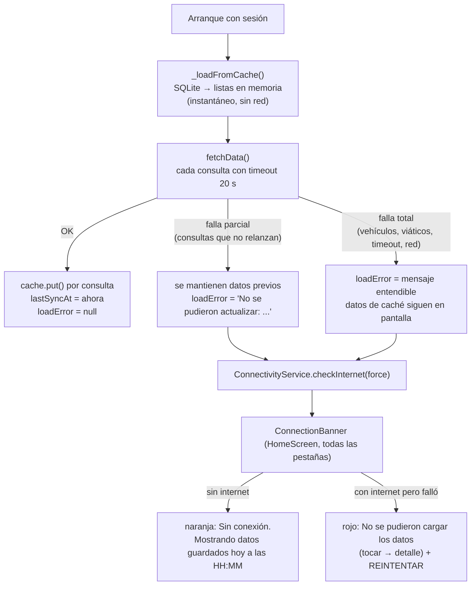
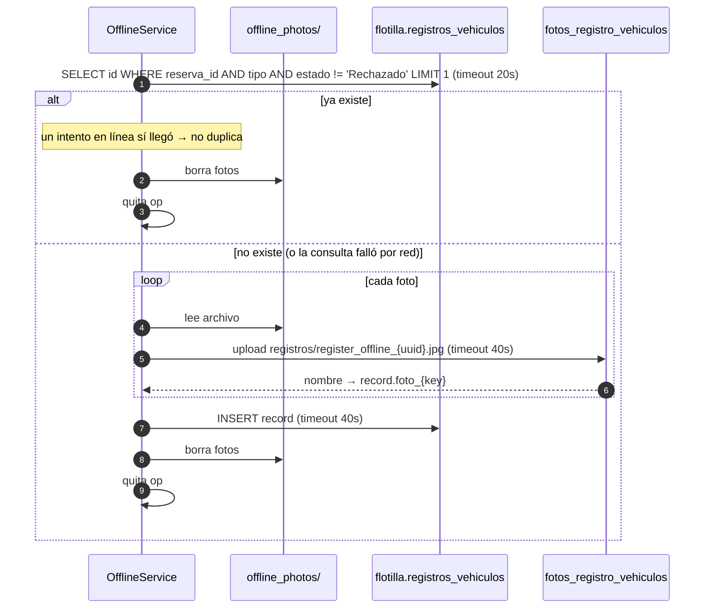
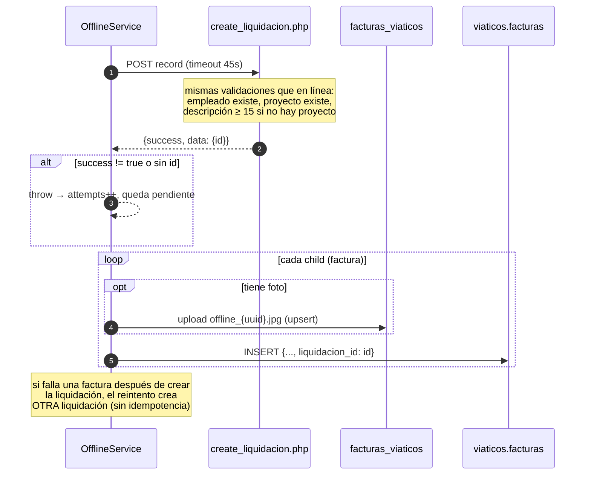

# 8. Modo offline

Fuente: [offline_service.dart](../lib/services/offline_service.dart).

Hay dos piezas: una **caché de lectura** en SQLite (tabla `cache`, ver [cache_service.dart](../lib/services/cache_service.dart)) que guarda lo último que se vio de vehículos, reservas, viáticos, visitas, proyectos, empleados, departamentos, empresas, vehículos personales y el perfil del empleado con sus permisos; y una **cola de escritura** que guarda operaciones en el teléfono y las sube cuando vuelve la red.

## 8.0 Caché de lectura y banner de conexión



- La caché se separa por usuario (`email:clave`) y se borra al cerrar sesión.
- `ConnectivityService` ([connectivity_service.dart](../lib/services/connectivity_service.dart)) combina `connectivity_plus` (¿hay red?) con un sondeo HTTP al REST de Supabase con timeout de 4 s (¿hay internet real?). Se re-sondea al cambiar de red, al reintentar desde el banner y tras una carga fallida. `OfflineService.hayConexion()` ahora usa este sondeo, así que en Wi-Fi sin salida un registro se encola de inmediato en vez de agotar los timeouts de subida.
- `fetchData()` ya no deja pantallas vacías en silencio: `loadError` siempre queda con un mensaje cuando algo falló, y las consultas que antes vaciaban su lista al fallar (visitas, proyectos, empleados, departamentos, empresas) ahora conservan lo anterior.

## 8.1 Qué se persiste y dónde

| Dato | Dónde | Formato |
|------|-------|---------|
| Cola de operaciones | `SharedPreferences`, clave `offline_queue_v1` | JSON de una lista de mapas |
| Fotos pendientes | `<documentos de la app>/offline_photos/<uuid>.<ext>` | Copia del archivo original |

No usa SQLite, Hive ni Isar. Cada operación en la cola tiene esta forma:

```json
{
  "id": "uuid",
  "type": "registro_vehiculo | factura | liquidacion",
  "record": { "...campos a insertar..." },
  "photos": { "frente": "/ruta/local.jpg", "kilometraje": "/ruta/local2.jpg" },
  "children": [ { "record": {...}, "photos": { "documento": "/ruta.jpg" } } ],
  "createdAt": "2026-09-11T14:30:00Z",
  "attempts": 0,
  "lastError": "..."
}
```

`children` solo se usa para el tipo `liquidacion`: son las facturas que dependen del id que devuelva el servidor.

## 8.2 Quién encola

| Tipo | Pantalla | Cuándo |
|------|----------|--------|
| `registro_vehiculo` | `VehicleRegisterScreen` | Sin conexión, o si el guardado en línea devolvió `false` o lanzó excepción |
| `liquidacion` | `LiquidacionFormScreen` | Sin conexión al guardar una liquidación **nueva** |
| `factura` | `LiquidacionDetailScreen` | Sin conexión al agregar una factura **nueva** a una liquidación existente |

Editar (no crear) siempre requiere conexión.

## 8.3 Ciclo de vida de la cola


Reglas:

- **Nunca se borra una operación hasta que el servidor confirma.** En el peor caso queda visible como pendiente en el banner del Dashboard.
- No hay límite de reintentos ni backoff. Cada `flush` intenta todo lo pendiente.
- Solo corre un `flush` a la vez (`_flushing`).
- `hayConexion()` consulta `connectivity_plus`. Si la consulta falla, asume que sí hay red y deja que el upload real decida.

## 8.4 Sincronización de un registro de vehículo



## 8.5 Sincronización de una liquidación con facturas



## 8.6 Indicador en la interfaz

El Dashboard tiene un `Consumer<OfflineService>` que muestra un banner con `pendingCount` y un botón "Subir ahora" que llama `flush()`. Mientras `isFlushing` es `true` muestra un spinner.

## 8.7 Limitaciones conocidas

- La caché de lectura es "última respuesta conocida": no hay sincronización incremental ni resolución de conflictos. Sin conexión se puede **ver**, no crear reservas ni visitas.
- Solo tres tipos de operación en la cola de escritura. Visitas, auditorías, reservas y correcciones no funcionan sin conexión.
- `liquidacion` y `factura` no tienen chequeo de duplicados. Un timeout después de que el servidor insertó puede generar registros repetidos en el siguiente `flush`.
- Si sube la foto pero falla el `INSERT`, el reintento vuelve a subir la foto y deja un archivo huérfano en Storage.
- Toda la cola vive en un solo string JSON en `SharedPreferences`, cargado completo en memoria. Adecuado para decenas de operaciones, no para miles.
- La cola de escritura sigue en `SharedPreferences`; la base SQLite (`LocalDb`) ya existe y sería el destino natural si se necesita consultarla o escalarla.
