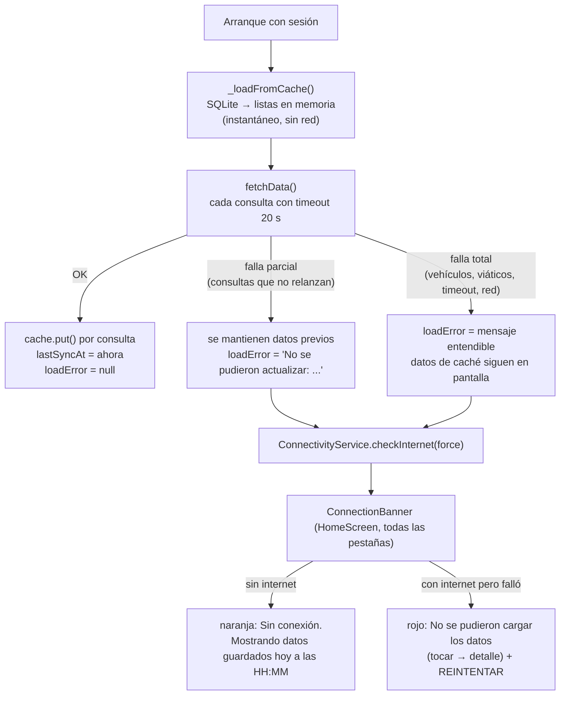
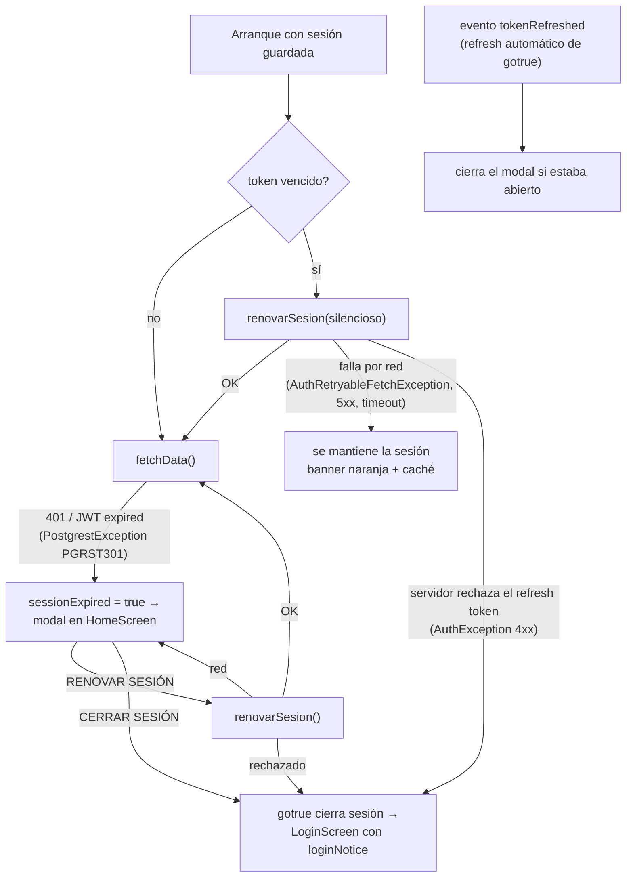
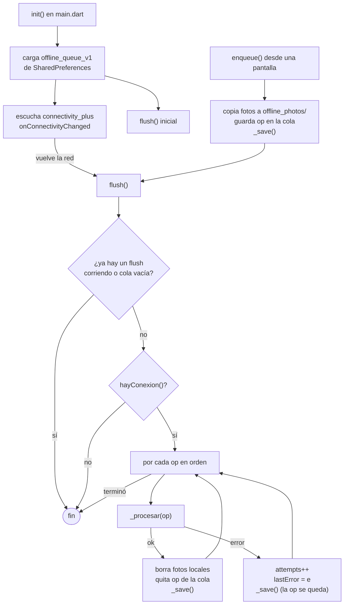
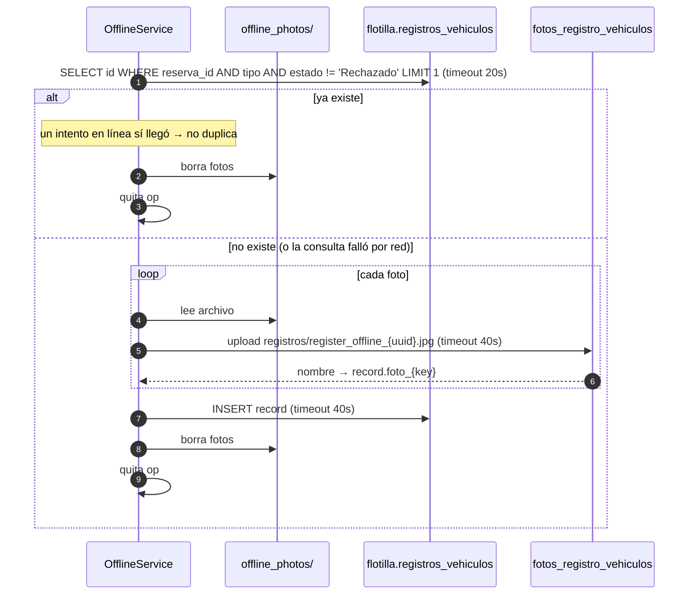
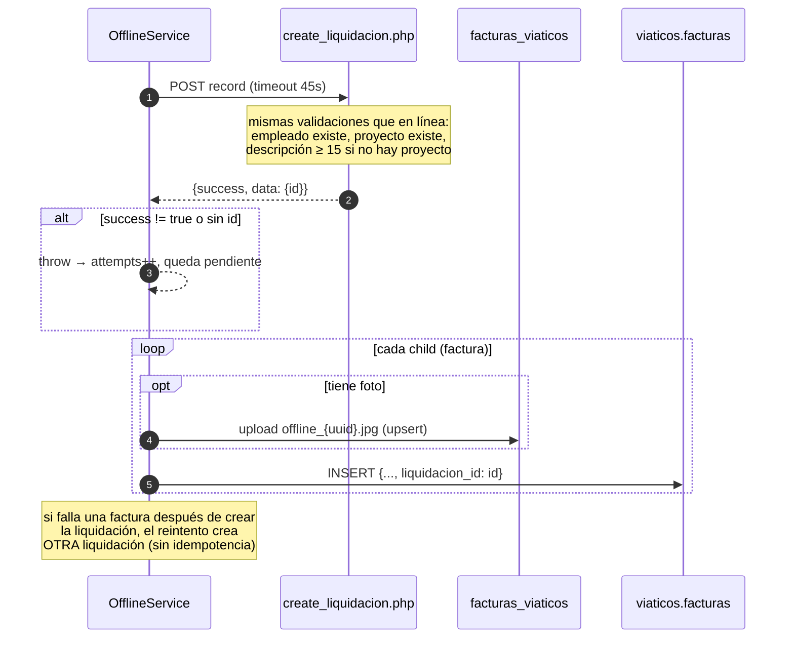

# 8. Modo offline

Fuente: [offline_service.dart](../lib/services/offline_service.dart).

Hay dos piezas: una **caché de lectura** en SQLite (tabla `cache`, ver [cache_service.dart](../lib/services/cache_service.dart)) que guarda lo último que se vio de vehículos, reservas, viáticos, visitas, proyectos, empleados, departamentos, empresas, vehículos personales y el perfil del empleado con sus permisos; y una **cola de escritura** que guarda operaciones en el teléfono y las sube cuando vuelve la red.

## 8.0 Caché de lectura y banner de conexión



- La caché se separa por usuario (`email:clave`) y se borra al cerrar sesión.
- `ConnectivityService` ([connectivity_service.dart](../lib/services/connectivity_service.dart)) combina `connectivity_plus` (¿hay red?) con un sondeo HTTP al REST de Supabase con timeout de 4 s (¿hay internet real?). Se re-sondea al cambiar de red, al reintentar desde el banner y tras una carga fallida. `OfflineService.hayConexion()` ahora usa este sondeo, así que en Wi-Fi sin salida un registro se encola de inmediato en vez de agotar los timeouts de subida.
- `fetchData()` ya no deja pantallas vacías en silencio: `loadError` siempre queda con un mensaje cuando algo falló, y las consultas que antes vaciaban su lista al fallar (visitas, proyectos, empleados, departamentos, empresas) ahora conservan lo anterior.
- El empleado (`currentEmployeeId` y permisos) se guarda en la caché (`perfil`). Con sesión abierta o caché, `fetchData()` no espera la consulta de `Empleados`: la refresca en paralelo. Solo la espera cuando no hay ningún id conocido, y si aun así falla queda como fallo visible en el banner.

### Sesión expirada



La clasificación vive en `_clasificarErrorSesion()`: `AuthRetryableFetchException` y `statusCode` 5xx son red; cualquier otra `AuthException` es sesión inválida; `PostgrestException` con código `PGRST301`/`401` o mensaje con `jwt` es sesión inválida. Todo queda en el log, módulo `auth`.

## 8.1 Qué se persiste y dónde

Todo vive en la base SQLite `mecsa_ops_local.db` ([local_db.dart](../lib/services/local_db.dart), versión 4). Las fotos pendientes se copian a `<documentos de la app>/offline_photos/<uuid>.<ext>`.

| Tabla | Qué guarda | Quién la escribe |
|-------|------------|------------------|
| `cache` | Última respuesta JSON de cada consulta (`email:clave`) | `CacheService` |
| `offline_queue` | Cola de operaciones. `estado` = `pendiente` o `subido`; las subidas se conservan 30 días como historial con `synced_ms` y `remote_id` | `OfflineService` |
| `reservas` | Reservas del usuario tal como las devuelve el API (con el join de vehículo). Se **sobrescriben completas** en cada sincronización: el servidor manda | `ReservasLocal` desde `_fetchMyReservations()` |
| `liquidaciones` | Liquidaciones del **último mes** (30 días) con sus facturas, traídas al iniciar sesión y en cada `fetchData()` (`local = 0`), más las creadas sin conexión (`local = 1`, id `local-…`) | `LiquidacionesLocal` |
| `cache` (`liq_empleados`, `liq_proyectos`) | Personal para "personal incluido" y los 100 proyectos más recientes, para crear liquidaciones sin conexión. Se refrescan en `fetchData()` y en la copia diaria | `LiquidacionesService` |
| `vehiculos` | Vehículos personales del empleado (`visitas.vehiculos_personales`), sobrescritos en cada sincronización. Permiten iniciar visitas sin red | `VehiculosLocal` (v4) |
| `id_map` | `local-<uuid>` → id real del servidor, para operaciones encadenadas | `OfflineService` |
| `app_log` | Log de diagnóstico | `AppLogger` |

La cola de versiones anteriores (`SharedPreferences`, clave `offline_queue_v1`) se migra a `offline_queue` la primera vez que arranca `OfflineService.init()` y se borra.

Cada operación en la cola (`payload`) tiene esta forma:

```json
{
  "id": "uuid",
  "type": "registro_vehiculo | factura | liquidacion | visita_crear | visita_inicio | visita_waypoints | visita_fin",
  "record": { "...campos a insertar..." },
  "photos": { "frente": "/ruta/local.jpg", "kilometraje": "/ruta/local2.jpg" },
  "children": [ { "record": {...}, "photos": { "documento": "/ruta.jpg" } } ],
  "createdAt": "2026-09-11T14:30:00Z",
  "localId": "local-uuid (solo si el registro se creó offline)",
  "attempts": 0,
  "lastError": "...",
  "estado": "pendiente | subido",
  "syncedMs": 1789150000000,
  "remoteId": "id que devolvió el servidor"
}
```

`children` solo se usa para el tipo `liquidacion`: son las facturas que dependen del id que devuelva el servidor.

### Ids locales

Una visita o liquidación creada sin conexión recibe un id `local-<uuid>` (`OfflineService.nuevoIdLocal()`). La app la muestra en las listas con el icono de "pendiente de subir" y las operaciones posteriores (waypoints, finalizar, facturas) guardan ese id local. Al subir la operación padre, `id_map` registra el id real; las operaciones hijas lo resuelven con `resolverId()` y, si el padre aún no subió, fallan con "aún no se ha subido" y se reintentan en el siguiente `flush`. Como la cola se procesa en orden de creación, el padre siempre va primero.

## 8.2 Quién encola

| Tipo | Pantalla | Cuándo |
|------|----------|--------|
| `registro_vehiculo` | `VehicleRegisterScreen` | Sin conexión, o si el guardado en línea devolvió `false` o lanzó excepción. Aplica a salida y entrada de una reserva aprobada; el detalle de la reserva muestra un aviso naranja mientras esté pendiente |
| `liquidacion` | `LiquidacionFormScreen` | Sin conexión al guardar una liquidación **nueva**. Además se guarda en la tabla `liquidaciones` (`local = 1`) para verla en la lista |
| `factura` | `LiquidacionDetailScreen` | Sin conexión al agregar una factura **nueva** a una liquidación existente |
| `visita_crear` | `VisitaFormScreen` → `AppProvider.createVisita` | Sin conexión al registrar una visita desde el formulario (fotos incluidas) |
| `visita_inicio` | `VisitaInicioScreen` → `startVisitaV2` | Sin conexión al iniciar una visita "en ruta"; devuelve un id local y el viaje sigue normal |
| `visita_waypoints` | `updateVisitaWaypointsV2` | Sin conexión los waypoints solo se guardan en caché; viajan completos con `visita_fin` |
| `visita_fin` | `VisitaInicioScreen` → `finishVisitaV2` | Sin conexión (o visita con id local). El kilometraje y el monto los calcula `finish_visita.php` al subir |

**Reservas: nunca se encolan.** Crear una reserva exige validar disponibilidad y choques de horario contra el servidor en el momento, así que `createReservation()` rechaza sin conexión y el formulario desactiva el botón con un aviso rojo. Lo que sí funciona sin red es **ver** las reservas (tabla `reservas`) y **registrar salida/entrada** de una aprobada (se encola `registro_vehiculo`).

Editar (no crear) siempre requiere conexión.

## 8.3 Ciclo de vida de la cola



Reglas:

- **Nunca se borra una operación hasta que el servidor confirma.** Cuando confirma, la fila pasa a `estado = 'subido'` con `synced_ms` (no se borra: queda como historial 30 días, consultable con `OfflineService.historial()`).
- No hay límite de reintentos ni backoff. Cada `flush` intenta todo lo pendiente.
- Solo corre un `flush` a la vez (`_flushing`).
- `hayConexion()` usa el sondeo real de `ConnectivityService`. Si la consulta falla, asume que sí hay red y deja que el upload real decida.

### Cuándo se sincroniza sola

1. Al arrancar (`flush()` inicial).
2. Cuando `connectivity_plus` reporta que apareció una red.
3. Cuando `ConnectivityService` pasa de "sin internet" a "internet OK" (sondeo real). En ese momento `AppProvider` también hace `refreshSilent()` para traer reservas, liquidaciones y visitas frescas.
4. Cada 45 segundos (`OfflineService.retryInterval`) mientras haya pendientes: cubre el Wi-Fi que recupera salida sin cambiar de interfaz.
5. Al encolar algo nuevo y al tocar "Sincronizar" en el Dashboard.

Cuando una operación sube, `OfflineService.onOperacionSubida` avisa a `AppProvider`, que refresca la lista afectada (liquidaciones, visitas o reservas) y así el registro local pendiente se reemplaza por el del servidor.

## 8.4 Sincronización de un registro de vehículo



## 8.5 Sincronización de una liquidación con facturas



## 8.6 Indicador en la interfaz

El Dashboard tiene un `Consumer<OfflineService>` que muestra un banner con `pendingCount` y un botón "Subir ahora" que llama `flush()`. Mientras `isFlushing` es `true` muestra un spinner.

## 8.7 Copia de seguridad diaria (Perfil → Copias de seguridad)

`SyncService` ([sync_service.dart](../lib/services/sync_service.dart)) es el equivalente a la copia de seguridad de WhatsApp:

1. Sube todo lo pendiente (`OfflineService.flush()`).
2. Vuelve a bajar reservas, liquidaciones del último mes (con facturas) y visitas del usuario y las guarda en SQLite/caché, sobrescribiendo con lo que diga el API.
3. Mientras corre muestra la notificación "Sincronizando con el servidor…" (canal `channel_sync`, con barra de progreso) y al terminar "Sincronización completa" con el resumen.

Se ejecuta a mano con "Sincronizar ahora" y automáticamente todos los días a la hora configurada (por defecto **02:00**) con WorkManager (`Workmanager().registerPeriodicTask`, frecuencia 24 h, `initialDelay` hasta la próxima hora elegida). La tarea corre todos los días; `sincronizarSiToca()` decide si hoy corresponde según la frecuencia (semanal/mensual) y evita repetir si ya se hizo ese día. El callback `syncCallbackDispatcher` vive en `main.dart` porque el isolate de fondo arranca vacío: inicializa logger, Supabase (la sesión persiste en el dispositivo), `ConnectivityService` y `OfflineService`, y llama `SyncService.sincronizar()`.

Opciones (SharedPreferences `backup_*`): activar/desactivar, frecuencia (**diaria**, **semanal** con día de la semana, o **mensual** con día del mes 1-28), hora, y red permitida: **solo WiFi** (constraint `NetworkType.unmetered`, por defecto) o **WiFi o datos móviles** (`NetworkType.connected`). La copia manual y la sincronización al recuperar conexión ignoran esa restricción. Android puede mover la ejecución unos minutos (Doze, batería baja); no es un reloj exacto.

La pantalla ([backup_settings_screen.dart](../lib/screens/backup_settings_screen.dart)) muestra además la lista de pendientes con su último error y el historial de lo subido recientemente (`OfflineService.historial()`).

## 8.8 Comprobantes y PDF de liquidación

- `ComprobantesService` guarda cada comprobante (imagen del bucket `facturas_viaticos`) en `<documentos de la app>/comprobantes/` la primera vez que se ve o al abrir el detalle con red (`precargar`). Las facturas agregadas sin conexión usan directamente su foto local.
- El botón "Ver" abre `ComprobanteViewerScreen` (zoom, dentro de la app). Sin red se ven los que ya están en caché; los PDF se abren con la app externa.
- "Exportar PDF" en el detalle (`LiquidacionPdfService`) arma datos generales, tabla de facturas, totales y una página por comprobante, y lo comparte con `Printing.sharePdf`. Funciona sin conexión con lo que haya en caché.

### Visitas: PDF y fotos

En "Detalle de Visita" hay dos acciones: **Exportar PDF** (`VisitaPdfService`: datos, recorrido, notas y una página por foto, compartido con `Printing.sharePdf`) y **Guardar fotos** en la galería (álbum MecsaOPS, con `gal`). Ambas aceptan fotos por URL o por ruta local (visitas creadas sin conexión).

## 8.9 Limitaciones conocidas

- La caché de lectura es "última respuesta conocida": no hay sincronización incremental ni resolución de conflictos.
- Crear reservas, editar visitas ya subidas, auditorías y correcciones siguen requiriendo conexión.
- `liquidacion`, `factura` y `visita_fin` no tienen chequeo de duplicados. Un timeout después de que el servidor insertó puede generar registros repetidos en el siguiente `flush`. `visita_inicio` y `visita_crear` sí son idempotentes vía `id_map`.
- Si sube la foto pero falla el `INSERT`, el reintento vuelve a subir la foto y deja un archivo huérfano en Storage.
- Una visita iniciada sin conexión no se puede abrir en `VisitaDetailScreen` ni editar hasta que suba (id local).
- La lista de liquidaciones sin red muestra solo el último mes (lo que hay en SQLite); no hay paginación offline.
- Los comentarios de una liquidación no se guardan localmente; sin red no se ven.
- Los mensajes de error para el usuario salen de `mensajeError()` ([mensajes_error.dart](../lib/utils/mensajes_error.dart)): red, timeout, sesión, permisos y duplicados tienen texto fijo; el detalle técnico va solo al log.
