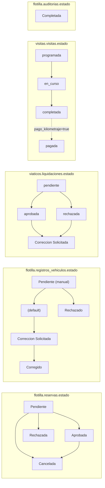

# 9. Modelo de datos e integraciones

Inventario de todo lo externo que toca la app. El esquema de Postgres se administra desde el panel de Supabase; no hay migraciones versionadas ni en este repo ni en `MecsaOPS`.

## 9.1 Tablas de Supabase por schema

### `public`

| Tabla | Uso en la app | Columnas relevantes |
|-------|---------------|---------------------|
| `Empleados` | Identidad, rol, permisos, token push, bloqueo | `id`, `id_user`, `email`, `nombre`, `apellido`, `telefono`, `activo`, `rol`, `chat_role`, `sistemas_acceso[]`, `departamento`, `photo`, `fcm_token`, `reservas_bloqueado`, `mfa_grace_until`, `codigo_empleado`, `tenant_id` |
| `Empresas` | Dropdown del registro | `id`, `nombre_comercial` |
| `rol_permisos` | Permisos por rol | `rol_nombre`, `vista_slug`, `puede_ver` |
| `viaticos_responsables_departamento` | Quién aprueba viáticos de qué departamento | `empleado_id`, `departamento_id` |
| `mfa_backup_codes` | Solo servidor | `user_id`, `code_hash` (bcrypt) |

### `cms`

| Tabla | Uso | Columnas |
|-------|-----|----------|
| `departamento` | Dropdown del registro, nombre en perfil | `id`, `nombre`, `id_empresa` |

### `flotilla`

| Tabla | Uso | Columnas relevantes |
|-------|-----|---------------------|
| `vehiculos` | Catálogo de flotilla | `id`, `marca`, `modelo`, `placa`, `year`, `estado`, `foto`, `type`, `km_actual` |
| `reservas` | Reservas de vehículos | `id`, `vehiculo_id`, `empleado_id`, `fecha_salida`, `fecha_regreso`, `motivo`, `proyecto_id`, `ubicacion` ("LAT,LNG\|dirección"), `personal_incluido`, `estado`, `comentarios`, `fecha_aprobacion`, `created_at` |
| `registros_vehiculos` | Salida y entrada | `id`, `reserva_id`, `empleado_id`, `tipo` (salida/entrada), `kilometraje`, `nivel_aceite`, `nivel_combustible`, `estado_pintura`, `estado_llantas`, `estado_interiores`, `posee_kit`, `posee_refraccion`, `posee_compass`, `ubicacion`, `foto_frente`, `foto_lateral_der`, `foto_lateral_izq`, `foto_trasera`, `foto_kilometraje`, `estado`, `es_manual`, `comentario`, `fecha_registro`, `solicitud_correccion`, `fecha_correccion`, `respuesta_admin`, `corregido_por` |
| `auditoria_rubrica` | Ítems de inspección | `id`, `categoria`, `item_slug`, `item_label`, `ayuda`, `solo_pesados`, `orden`, `activo` |
| `auditorias` | Cabecera de auditoría | Ver [Auditorías 6.1](06-auditorias.md#61-modelo) |
| `auditoria_items` | Resultado por ítem | `auditoria_id`, `rubrica_id`, `item_slug`, `item_label`, `categoria`, `resultado`, `observacion`, `fotos` |

### `viaticos`

| Tabla | Uso | Columnas relevantes |
|-------|-----|---------------------|
| `liquidaciones` | Cabecera de gastos | `id`, `empleado_id`, `fecha`, `tarjeta_ult4`, `proyecto_id`, `tipo`, `personal_incluido`, `total`, `descripcion`, `estado`, `aprobado_por`, `fecha_aprobacion`, `comentario_aprobacion`, `solicitud_correccion`, `fecha_correccion`, `respuesta_admin`, `created_at` |
| `facturas` | Comprobantes | `id`, `liquidacion_id`, `tipo`, `proveedor`, `numero_factura`, `monto`, `fecha`, `documento` |
| `liquidacion_comentarios` | Hilo de comentarios | `liquidacion_id`, `autor_id`, `autor_nombre`, `comentario`, `created_at` |

### `visitas`

| Tabla | Uso | Columnas relevantes |
|-------|-----|---------------------|
| `visitas` | Visitas y rutas | `id`, `empleado_id`, `estado`, `fecha`, `hora_inicio`, `hora_fin`, `lat`, `lng`, `cliente`, `direccion`, `tipo_visita`, `proyecto_id`, `notas`, `fotos[]`, `destinos[]`, `vehiculo_id`, `odometro_inicial`, `odometro_final`, `foto_odometro_inicio`, `foto_odometro_fin`, `waypoints[]`, `proyectos_visitados[]`, `observaciones`, `km_recorridos`, `duracion_minutos`, `tarifa_aplicada`, `monto_pago_km`, `pago_kilometraje`, `comprobante_pago`, `fecha_pago`, `pago_reportado_por` |
| `vehiculos_personales` | Vehículo propio del empleado | `id`, `empleado_id`, `alias`, `antiguedad`, `tipo`, `combustible` |
| `ops_tracking` | Puntos GPS crudos | `user_id`, `user_email`, `latitude`, `longitude`, `accuracy`, `speed`, `heading`, `activity_id` |

### `proyectos`

| Tabla | Uso | Columnas |
|-------|-----|----------|
| `projects` | Selector de proyecto | `project_id`, `title` |

## 9.2 Funciones SQL (RPC)

| Función | Schema | Quién la llama | Qué hace |
|---------|--------|----------------|----------|
| `mfa_must_enroll(p_user_id)` | public | `MfaService.evaluateAfterLogin` | `true` si el usuario no tiene factor TOTP y `mfa_grace_until` ya venció |
| `mfa_consume_backup_code(p_user_id, p_code_plain, p_ip)` | public | `backup_code_verify.php` | Compara bcrypt y marca el código como usado. Atómico |
| `mfa_admin_reset_user(p_user_id)` | public | `mfa/admin_reset.php` (web) | Borra factores y reinicia la gracia a 14 días |
| `aplicar_bloqueo_si_corresponde(p_empleado_id)` | flotilla | `createReservation` | Pone `reservas_bloqueado = true` con 3 o más reservas vencidas sin salida |
| `recompute_auditoria(p_auditoria_id)` | flotilla | `AuditoriaService.crearAuditoria` | Calcula puntaje y conteos de la auditoría |

## 9.3 Buckets de Storage

| Bucket | Prefijo | Quién escribe | Contenido |
|--------|---------|---------------|-----------|
| `empleados` | `temp_registration/`, `{empleado_id}/` | Registro, perfil | Foto de perfil |
| `flotilla` | | Web | Foto del vehículo (la app solo lee con `getPublicUrl`) |
| `fotos_registro_vehiculos` | `registros/`, `auditorias/` | Registro de salida/entrada, offline, auditorías | Fotos de inspección |
| `facturas_viaticos` | raíz, `odometros/`, `pago_*` | Facturas, offline, `finish_visita.php`, `pago_visita.php` | Comprobantes y fotos de odómetro |
| `visitas_fotos` | `visitas/` | `startVisitaV2`, `finishVisitaV2` | Fotos de odómetro de visitas |

## 9.4 Endpoints PHP consumidos por la app

Base: `https://grupomecsa.net/ops/api/`. Código en el repositorio `MecsaOPS/api/`.

| Endpoint | Método | Autenticación | Escribe en | Notifica | Llamado desde |
|----------|--------|---------------|------------|----------|---------------|
| `check_version.php` | GET | Ninguna | Nada (lee `app_version.json`) | No | `_checkAppVersion` |
| `register_employee_mobile.php` | POST | Ninguna (service_role interno) | `public.Empleados` | No | `signUp` |
| `request_password_reset.php` | POST | Ninguna | Auth (generate_link) | Email SMTP | `requestPasswordReset` |
| `create_liquidacion.php` | POST | Ninguna (`empleado_id` sin verificar) | `viaticos.liquidaciones` | Bitrix24 `im.notify` | `createLiquidacion`, offline |
| `approve_liquidacion.php` | PATCH | `actor_id` re-validado en BD | `viaticos.liquidaciones` | Push FCM | `AdminService.aprobarLiquidacion` |
| `finish_visita.php` | POST | Ninguna | `visitas.visitas`, Storage | No | `finishVisitaV2` |
| `mfa/backup_codes_generate.php` | POST | Bearer JWT Supabase | `public.mfa_backup_codes` | No | `enrollVerify` |
| `mfa/backup_code_verify.php` | POST | Bearer JWT Supabase | RPC + `Empleados.mfa_grace_until` | No | `backupCodeVerify` |

Endpoints del servidor que afectan a la app pero que ella no llama: `pago_visita.php` (envía el push `pago_kilometraje`), `approve_employee.php` (activa la cuenta registrada), `aprobar_registro_manual.php`, `toggle_reservas_bloqueo.php`, `procesar_correccion.php`.

## 9.5 Otras integraciones

| Servicio | Uso | Dónde |
|----------|-----|-------|
| Google Directions API | Ruta y pasos de navegación | `TripNavScreen` |
| Google Geocoding API | Dirección a coordenadas y viceversa | `TripNavScreen`, `MapPickerScreen` |
| Google Places API | Autocompletar direcciones (país CR) | `MapPickerScreen` |
| Firebase Cloud Messaging | Push desde el servidor | `HomeScreen`, `fcm_v1_helper.php` |
| Bitrix24 | Aviso interno al crear liquidación | Solo servidor |
| Web OPS embebida | Chat CRM con auto-login `login.php?app_uid=...&embed=1` | `DashboardTab` |

## 9.6 Estados por entidad

Nota sobre mayúsculas: reservas y registros usan `Capitalizado`, liquidaciones y visitas usan `minúsculas`. El provider cuenta liquidaciones pendientes comparando contra `'Aprobado'` (que nunca ocurre), así que en la práctica cuenta todas. Ver [Observaciones](10-observaciones.md).
