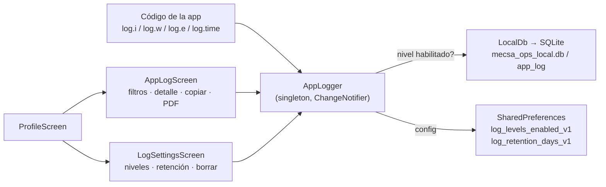
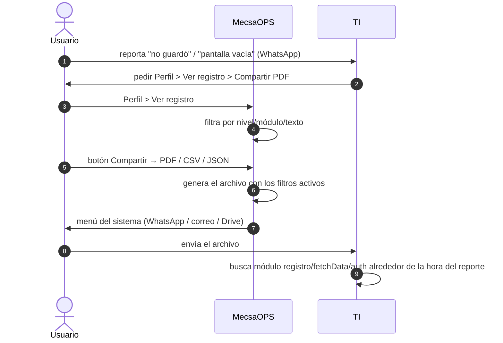

# 11. Registro de actividad (log local)

Fuente: [app_logger.dart](../lib/services/app_logger.dart), [local_db.dart](../lib/services/local_db.dart), [app_log_screen.dart](../lib/screens/app_log_screen.dart), [log_settings_screen.dart](../lib/screens/log_settings_screen.dart).

Base de datos local SQLite (paquete `sqflite`) con una tabla `app_log` donde la app guarda lo que hace y lo que falla. Existe para diagnosticar reportes de campo (pantallas vacías, registros que "no guardan") sin depender de la memoria del usuario. **No se envía a ningún servidor**: el usuario lo comparte desde Perfil cuando TI se lo pide.

## 11.1 Componentes



## 11.2 Niveles

| Nivel | Valor | Por defecto | Uso |
|-------|-------|-------------|-----|
| `debug` | 0 | apagado | Paso a paso técnico (cada consulta de `fetchData`, `hayConexion`, GPS). Genera volumen; activar solo para diagnosticar. |
| `info` | 1 | activo | Eventos normales: arranque, eventos de sesión, carga completa, registro guardado, cola offline. |
| `warning` | 2 | activo | Anormal pero no fatal: sin red, fallback de reservas, sin ubicación, empleado no encontrado. |
| `error` | 3 | activo | Fallas: consulta que no respondió, insert fallido, login fallido, errores no capturados de Flutter/Dart. |

El usuario elige qué niveles se guardan en **Perfil > Configurar registro**. Un nivel apagado no se escribe (no hay costo).

## 11.3 Esquema de `app_log`

| Columna | Tipo | Contenido |
|---------|------|-----------|
| `id` | INTEGER PK | autoincremental |
| `ts_ms` | INTEGER | epoch ms (UTC), indexado |
| `ts` | TEXT | ISO-8601 local, legible |
| `level` / `level_name` | INTEGER / TEXT | ver tabla anterior |
| `module` | TEXT | `app`, `auth`, `fetchData`, `registro`, `reservas`, `offline`, `log` |
| `message` | TEXT | texto corto |
| `data` | TEXT | JSON con contexto (`ms`, `reserva_id`, `tipo`, conteos...) |
| `error` / `stack` | TEXT | excepción y stack trace recortados (2 000 / 4 000 chars) |
| `usuario` | TEXT | email de la sesión activa |
| `app_version` | TEXT | `version+build` |

Retención: se borran entradas más viejas que `retentionDays` (por defecto 14, configurable 3–60) y se conservan como máximo 5 000 filas. La poda corre al iniciar y cada 200 escrituras.

## 11.4 Qué se registra hoy

| Módulo | Evento | Nivel |
|--------|--------|-------|
| `app` | Arranque con versión, SO y versión de SO | info |
| `app` | Firebase inicializado / no disponible | info / warning |
| `app` | Resultado de `check_version.php` (build actual vs mínimo) | info / warning |
| `app` | Errores no capturados (`FlutterError.onError`, `PlatformDispatcher.onError`) | error |
| `auth` | Provider iniciado (¿sesión persistida?, expiración del token) | info |
| `auth` | Cada evento de `onAuthStateChange` (`signedIn`, `tokenRefreshed`, `signedOut`...) y errores del stream | info / error |
| `auth` | Empleado no encontrado por correo / consulta fallida | warning / error |
| `auth` | Login fallido | error |
| `fetchData` | Inicio, duración por consulta (`log.time`), resumen con conteos, falla general | info / debug / error |
| `fetchData` | Reservas: fallback sin join, fallback fallido | warning / error |
| `fetchData` | `refreshSilent` fallido | warning |
| `registro` | Guardar registro: inicio, verificación de duplicado, cada foto con duración, ubicación, insert, guardado OK, falla | info / debug / warning / error |
| `registro` | Registro manual guardado / fallido | info / error |
| `reservas` | Crear reserva fallida (con vehículo y fechas) | error |
| `offline` | Cola cargada, cambio de conectividad, `hayConexion`, operación encolada, flush iniciado/omitido, operación subida/fallida con intentos y duración | info / debug / warning / error |
| `log` | Cambios de configuración, borrado, exportación | info |

## 11.5 Flujo de diagnóstico con Operaciones



Formatos de exportación (respetan los filtros de nivel, módulo y texto activos en el visor):

| Formato | Para qué | Cómo se genera | Límite |
|---------|----------|----------------|--------|
| PDF | Leer en el teléfono o reenviar | paquete `pdf` + `Printing.sharePdf`, fuente Courier embebida (sin internet) | 1 500 entradas |
| CSV | Abrir en Excel / Google Sheets | `AppLogger.exportCsv()` → archivo temporal → `share_plus`. UTF-8 con BOM, `datos` como JSON en una celda | 5 000 entradas |
| JSON | Análisis en TI (scripts, jq) | `AppLogger.exportJson()` → archivo temporal → `share_plus`. Objeto con encabezado (`version`, `usuario`, `exportado`) y arreglo `log` | 5 000 entradas |

Las entradas van en orden cronológico (más antigua primero). El botón "Copiar" del visor sigue copiando la versión de texto al portapapeles.

Si TI necesita más detalle, pedir al usuario activar el nivel **Depuración** en Configurar registro, reproducir el problema y volver a compartir.

## 11.6 Cómo agregar registros nuevos

```dart
import '../services/app_logger.dart';

log.i('modulo', 'Qué pasó', data: {'id': x});
log.w('modulo', 'Algo raro', error: e);
log.e('modulo', 'Falló', error: e, stack: st);

// Medir y registrar duración; re-lanza la excepción si falla:
final r = await log.time('modulo', 'nombre de la acción', () => operacionAsync());
```

Reglas:

- `module` en minúsculas y estable: sirve como filtro en el visor.
- No incluir contraseñas, tokens ni datos personales más allá del email de sesión.
- `data` debe ser serializable a JSON (valores no serializables se convierten con `toString()`).
- El logger nunca lanza. Si la base no está lista, acumula hasta 500 entradas en memoria y las vuelca al abrir.

## 11.7 Otras tablas de `LocalDb`

`LocalDb` es el único punto de acceso a SQLite (`dbVersion = 2`). Además de `app_log` aloja `cache` (caché de lectura, ver [Modo offline §8.0](08-modo-offline.md)). La migración de la cola offline desde `SharedPreferences` sería la siguiente. Las tablas se agregan subiendo `dbVersion` y creándolas en `_onUpgrade`, sin borrar las existentes.

Módulos de log que agregó la caché: `cache` (carga desde caché, fallos de lectura/escritura) y `conectividad` (cambios de red, resultado de cada sondeo de internet).
