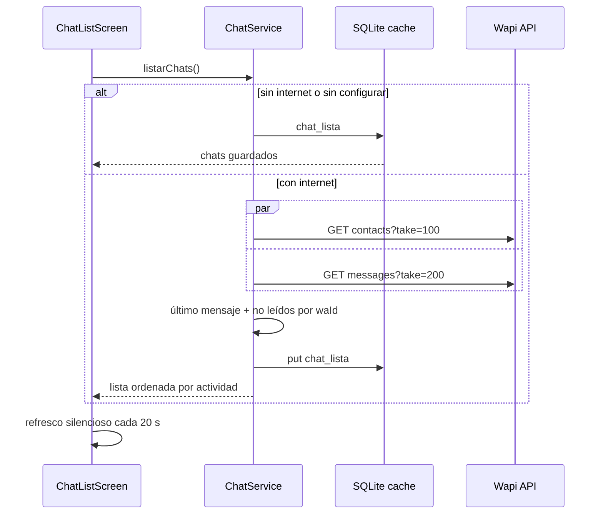

# 12. Chat CRM (WhatsApp) y centro de notificaciones

## 12.1 De dónde salen los chats

El chat del CRM **no vive en Supabase** (se buscó: las únicas tablas relacionadas, `cms.contactos` y `cms.clientes`, no contienen mensajes). Lo sirve **Wapi**, la plataforma .NET de WhatsApp de Grupo Mecsa, que expone una API REST por cuenta de WhatsApp. La app la consume directamente:

| Método | Endpoint | Uso en la app |
|--------|----------|---------------|
| GET | `/api/accounts/{cuenta}/contacts?take=100` | Lista de chats (contactos ordenados por actividad) |
| GET | `/api/accounts/{cuenta}/messages?take=200` | Últimos mensajes de la cuenta: se cruzan con los contactos para el último mensaje y los no leídos |
| GET | `/api/accounts/{cuenta}/contacts/{waId}/messages?take=100` | Historial de una conversación |
| POST | `/api/accounts/{cuenta}/messages/text` | Responder con texto (construido, apagado por ahora) |
| POST | `/api/accounts/{cuenta}/messages/{waMessageId}/read` | Marcar entrantes como leídos al abrir el chat |

Autenticación por header `X-Api-Key` con una clave de integración del tenant (ver `TenantKeyAttribute` en Wapi). La app **no modifica** Wapi ni Supabase.

## 12.2 Configuración

`ChatConfig` ([services/chat_service.dart](../lib/services/chat_service.dart)) guarda en SharedPreferences `chat_base_url`, `chat_account_id` y `chat_api_key`. Valores por defecto en compilación con `--dart-define=WAPI_BASE_URL=… --dart-define=WAPI_ACCOUNT_ID=… --dart-define=WAPI_API_KEY=…`. Un usuario con acceso al chat puede editarlos y probar la conexión en **Perfil → Chat CRM**. Mientras no esté configurado, la pestaña muestra un aviso.

El envío se controla con `--dart-define=WAPI_ENVIO=true` (`ChatConfig.envioHabilitado`). Hoy está apagado: la barra de respuesta existe, pero explica que se responde desde el CRM web. Al activarlo, el botón envía `POST messages/text` y respeta bloqueos, opt-out y ventana de 24 h (solo informativo; el servidor decide).

## 12.3 Quién lo ve

`AppProvider.puedeVerChat`: rol que contiene `admin`, `vendedor`, `ventas` o `asesor`, o `Empleados.chat_role` no vacío. Cuando aplica, `HomeScreen` agrega la pestaña **Chat** antes de Perfil y `BottomNav` muestra el destino. El botón "CHAT CRM" del Dashboard (que abría la web con SSO) se eliminó.

## 12.4 Pantallas

- `ChatListScreen`: avatar de iniciales con punto verde si la ventana de 24 h está abierta, nombre, último mensaje (con ✓/✓✓ si es saliente), hora, contador de no leídos, buscador, banner sin conexión.
- `ChatDetailScreen`: burbujas entrantes/salientes con fondo estilo WhatsApp (claro y oscuro), separadores por día, estado del mensaje, adjuntos como descripción (📷 Foto, 🎤 Audio…), etiquetas del contacto, barra de respuesta. Refresco cada 10 s mientras está abierta.

Sin conexión ambas pantallas muestran lo que quedó en la caché (`chat_lista`, `chat_msgs:<waId>`).

## 12.5 Centro de notificaciones (campana)

La campana del Dashboard abre `NotificationsScreen` con el historial guardado en la tabla `notificaciones` de SQLite (`NotificacionesService`, v5). Alimentan la campana:

| Origen | Tipo | Al tocar |
|--------|------|----------|
| Push FCM recibido con la app abierta (`onMessage`) | `visita` (pago de kilometraje) o `info` | Abre el detalle de la visita |
| Realtime: liquidación aprobada/rechazada | `liquidacion` | Va a la pestaña Viáticos |
| Operación offline que subió | `visita`, `liquidacion`, `reserva` o `sync` | Pestaña correspondiente |
| Fin de una copia de seguridad | `sync` | Perfil → Copias de seguridad |
| Nueva versión disponible | `version` | — |

El icono muestra el número de no leídas; la pantalla permite marcar todas como leídas, borrar una (deslizar) o todas. Se conservan las últimas 200 por usuario.
